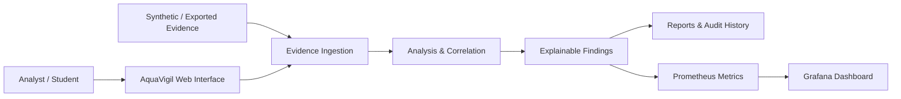
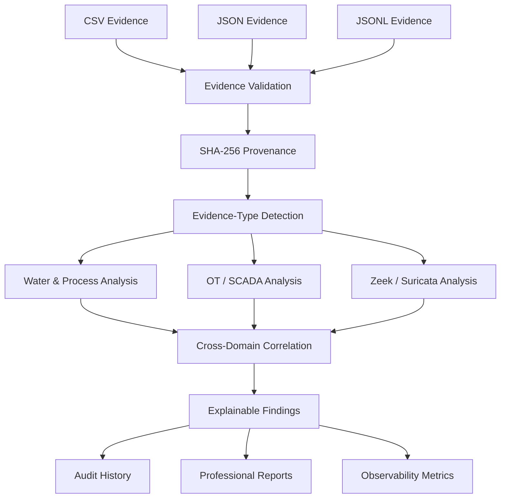
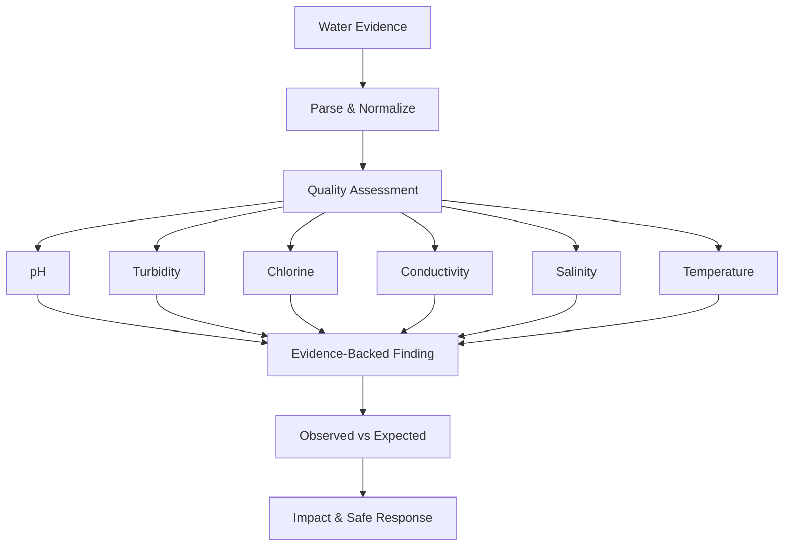
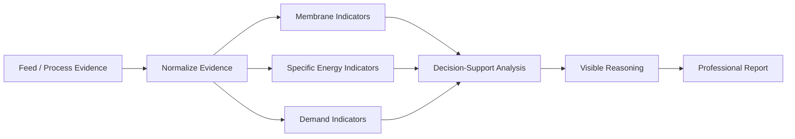
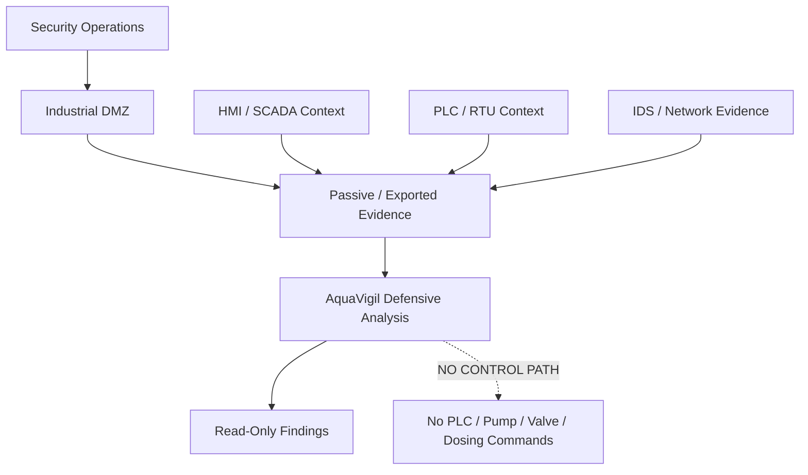
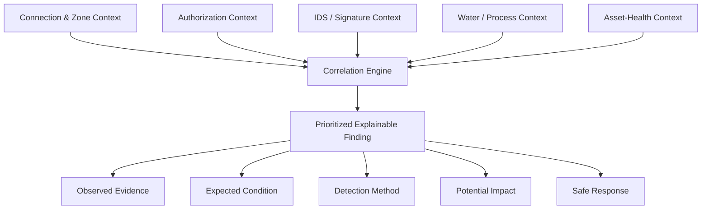
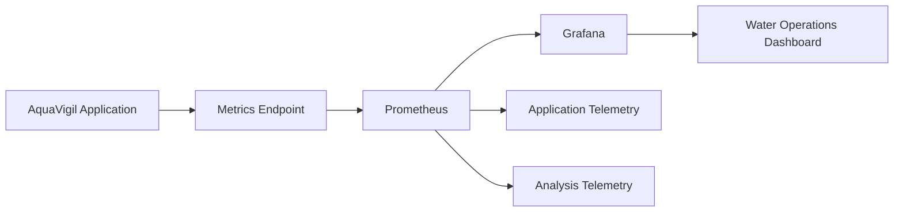
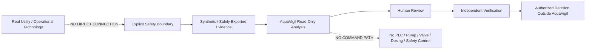

<p align="center">
  
</p>

<h1 align="center">AquaVigil</h1>

<h3 align="center">Smart Water & Desalination Infrastructure Security Platform</h3>

<p align="center">
  <strong>Evidence-Driven Water Intelligence • OT/SCADA Protection • Passive Monitoring • Explainable Analysis • Observability</strong>
</p>

<p align="center">
  <a href="CHANGELOG.md">
    
  </a>
  <a href="requirements.txt">
    
  </a>
  <a href="docker-compose.yml">
    
  </a>
  <a href=".github/workflows/ci.yml">
    
  </a>
  <a href="LICENSE">
    
  </a>
</p>

<p align="center">
  <strong>Defensive water intelligence with an explicit OT safety boundary.</strong>
</p>

---

> [!IMPORTANT]
> ## Safety Boundary
>
> AquaVigil is a **defensive, read-only, evidence-driven educational platform**.
>
> All bundled demonstration evidence is synthetic.
>
> AquaVigil must never be connected directly to a real water utility, SCADA network, PLC, RTU, pump, valve, dosing system, safety function, or other operational-control environment.
>
> AquaVigil provides evidence-backed decision support only. Operational authority remains outside the application.

---

## Table of Contents

- [Overview](#overview)
- [Why AquaVigil](#why-aquavigil)
- [Platform Workflow](#platform-workflow)
- [Core Capabilities](#core-capabilities)
- [Architecture](#architecture)
- [Water Quality Intelligence](#water-quality-intelligence)
- [Desalination Intelligence](#desalination-intelligence)
- [OT / SCADA Security](#ot--scada-security)
- [Threat Center & Passive Monitoring](#threat-center--passive-monitoring)
- [Asset Health](#asset-health)
- [Explainable Analysis](#explainable-analysis)
- [Reporting](#reporting)
- [Observability](#observability)
- [Synthetic Evidence Library](#synthetic-evidence-library)
- [Installation](#installation)
- [Running AquaVigil](#running-aquavigil)
- [Local Python Development](#local-python-development)
- [Repository Structure](#repository-structure)
- [Documentation](#documentation)
- [Demonstration Path](#demonstration-path)
- [Testing & Automation](#testing--automation)
- [Design Principles](#design-principles)
- [Security & Safety](#security--safety)
- [Limitations](#limitations)
- [Contributors](#contributors)
- [Version](#version)
- [License](#license)

---

# Overview

AquaVigil is a defensive cybersecurity and water-intelligence workstation designed to demonstrate how exported operational and security evidence can be:

**Ingested → Validated → Classified → Analyzed → Correlated → Explained → Monitored → Reported**

without sending commands to operational technology.

The platform brings together:

- Water-quality assurance
- Desalination intelligence
- OT/SCADA defensive analysis
- Passive network-security evidence
- Asset-health reasoning
- Threat correlation
- Explainable findings
- Evidence provenance
- Professional reporting
- Prometheus monitoring
- Grafana visualization
- Synthetic demonstration scenarios

The workflow begins with evidence supplied by the user.

AquaVigil validates that evidence, establishes provenance, determines the evidence type, evaluates relevant water/process and cybersecurity signals, correlates observations, and presents traceable findings.

---

# Why AquaVigil

Modern water and desalination infrastructure combines physical processes, industrial control systems, operational networks, quality monitoring, engineering constraints, and cybersecurity.

Looking at only one of those areas can hide important context.

AquaVigil demonstrates a unified defensive workflow in which:

- water-quality observations can be reviewed alongside cybersecurity evidence;
- desalination indicators can be interpreted with visible reasoning;
- OT/SCADA evidence can be examined without active control;
- Zeek-style and Suricata-style evidence can contribute network context;
- asset observations can support operational reasoning;
- findings can preserve evidence provenance;
- cyber and process observations can be correlated;
- results can be presented through reports and dashboards;
- humans remain responsible for final decisions.

AquaVigil is therefore designed around five central ideas:

**Evidence • Correlation • Explainability • Observability • Safety**

---

# Platform Workflow

A typical AquaVigil analysis follows this sequence:

```text
                    ┌──────────────────────┐
                    │   Evidence Supplied   │
                    │ CSV / JSON / JSONL   │
                    └──────────┬───────────┘
                               │
                               ▼
                    ┌──────────────────────┐
                    │ Evidence Validation  │
                    └──────────┬───────────┘
                               │
                               ▼
                    ┌──────────────────────┐
                    │ SHA-256 Provenance   │
                    └──────────┬───────────┘
                               │
                               ▼
                    ┌──────────────────────┐
                    │ Evidence Detection   │
                    └──────────┬───────────┘
                               │
              ┌────────────────┼────────────────┐
              │                │                │
              ▼                ▼                ▼
     ┌────────────────┐ ┌───────────────┐ ┌─────────────────┐
     │ Water / Process│ │   OT / SCADA  │ │ Network Security│
     │    Analysis    │ │    Analysis   │ │    Evidence     │
     └────────┬───────┘ └───────┬───────┘ └────────┬────────┘
              │                 │                  │
              └─────────────────┼──────────────────┘
                                │
                                ▼
                    ┌──────────────────────┐
                    │ Cross-Domain        │
                    │ Correlation         │
                    └──────────┬───────────┘
                               │
                               ▼
                    ┌──────────────────────┐
                    │ Explainable Findings │
                    └──────────┬───────────┘
                               │
                 ┌─────────────┼─────────────┐
                 │             │             │
                 ▼             ▼             ▼
             Reports       Workspace       Metrics
                                               │
                                               ▼
                                           Prometheus
                                               │
                                               ▼
                                            Grafana
```

AquaVigil stops at **analysis and decision support**.

It does not issue operational commands.

---

# Core Capabilities

| Domain | What AquaVigil Demonstrates |
|---|---|
| **Evidence Assurance** | CSV, JSON and JSONL ingestion with SHA-256 provenance |
| **Evidence Detection** | Automatic identification of supported evidence types |
| **Water Intelligence** | pH, conductivity, turbidity, chlorine, salinity, pressure, flow and temperature analysis |
| **Anomaly Analysis** | Deterministic operating-range checks and transparent recent-baseline reasoning |
| **Desalination Intelligence** | Membrane, fouling, specific-energy and daily-demand decision support |
| **OT / SCADA Protection** | Authorization, zone, connection, signature and process-context correlation |
| **Passive Monitoring** | Zeek-style connection evidence and Suricata EVE-style security events |
| **Threat Analysis** | Security-event review with operational context |
| **Asset Health** | Evidence-based asset-health reasoning |
| **Cyber-Process Correlation** | Combination of cyber, process and asset observations |
| **Explainability** | Observed evidence, expected condition, method, impact, source and safe response |
| **Reporting** | Report history, provenance, print/PDF workflow, HTML export and controlled deletion |
| **Observability** | Prometheus telemetry with a provisioned Grafana water-operations dashboard |
| **Standards Evidence** | Mapping to water-safety and industrial cybersecurity guidance |

---

# Architecture

AquaVigil uses a layered, evidence-driven architecture that separates:

- evidence acquisition;
- validation and provenance;
- analytical processing;
- cyber/process correlation;
- reporting;
- observability;
- operational authority.

The README presents the **eight architecture views most important for understanding AquaVigil**.

The complete technical architecture remains documented separately with **20 detailed architecture views**.

> [!NOTE]
> Full architecture documentation:
>
> [`docs/ARCHITECTURE.md`](docs/ARCHITECTURE.md)
>
> [`docs/ARCHITECTURE_CATALOG.md`](docs/ARCHITECTURE_CATALOG.md)

---

## 1. Platform Context

The platform accepts evidence from the user, performs defensive analysis, and converts the results into explainable findings, reports, and monitoring information.



AquaVigil accepts evidence and returns analysis.

It does not operate the underlying process.

---

## 2. End-to-End Evidence Architecture

The evidence pipeline establishes traceability before analytical results are produced.



The SHA-256 provenance stage allows analysis results to remain associated with the evidence supplied to the platform.

---

## 3. Water-Quality Analysis Pipeline

Water evidence is normalized and evaluated across relevant quality and process indicators.



The analysis supports review rather than replacing laboratory validation or qualified engineering judgment.

---

## 4. Desalination Intelligence Architecture

AquaVigil evaluates desalination evidence using membrane, energy, and demand-oriented indicators.



The purpose is to make the reasoning visible rather than presenting an unexplained result.

---

## 5. OT / SCADA Defensive Architecture

AquaVigil treats industrial-control information as defensive evidence rather than a command interface.



There is deliberately no AquaVigil-to-process command path.

---

## 6. Cyber-Process Correlation

Cybersecurity observations become more useful when they are evaluated alongside operational context.



This allows a finding to explain not only what was observed, but also why the observation matters.

---

## 7. Observability Architecture

AquaVigil exposes application telemetry to Prometheus for visualization through Grafana.



Observability remains separated from the evidence-analysis workflow while still being visible within the overall platform.

---

## 8. Safety-Boundary Architecture

The safety boundary separates AquaVigil's evidence-analysis role from operational authority.



AquaVigil ends at **evidence-backed decision support**.

Operational authority remains outside the application.

---

## Complete Architecture Documentation

The full architecture documentation contains **20 architecture views** covering:

1. Platform context
2. End-to-end evidence architecture
3. Logical component architecture
4. Water-quality analysis pipeline
5. Desalination intelligence architecture
6. Asset-health reasoning
7. OT / SCADA defensive architecture
8. Trust-zone and industrial-DMZ model
9. Passive monitoring architecture
10. Cyber-process correlation
11. Anomaly-analysis architecture
12. Reporting and audit architecture
13. Observability architecture
14. Docker deployment architecture
15. Application data stores
16. Safety-boundary architecture
17. Failure and recovery architecture
18. CI and quality-gate architecture
19. Conceptual water-process context
20. Human decision architecture

See:

- [`docs/ARCHITECTURE.md`](docs/ARCHITECTURE.md)
- [`docs/ARCHITECTURE_CATALOG.md`](docs/ARCHITECTURE_CATALOG.md)

---

# Water Quality Intelligence

AquaVigil provides evidence-driven water-quality analysis for supported datasets.

Relevant observations can include:

- pH
- Turbidity
- Chlorine
- Conductivity
- Salinity
- Temperature
- Pressure
- Flow

The analysis pipeline is designed around visible evidence and explicit reasoning.

### Observed Evidence

What was present in the supplied dataset.

### Expected Condition

The reference condition used by the analysis.

### Detection Method

How AquaVigil identified the observation.

### Potential Impact

Why the observation may deserve review.

### Safe Response

A defensive or verification-oriented next step.

> [!NOTE]
> AquaVigil does not claim laboratory certification from software analysis alone.

---

# Desalination Intelligence

The desalination workspace demonstrates analysis of evidence associated with desalination operations.

Supported reasoning can include:

- membrane-related indicators;
- fouling observations;
- feed/process evidence;
- specific-energy indicators;
- demand-oriented analysis;
- process trends;
- visible decision-support reasoning.

AquaVigil is designed to show **why** a desalination-related observation was produced rather than exposing only a final status.

---

# OT / SCADA Security

AquaVigil includes a defensive OT/SCADA security workspace for reviewing supplied evidence.

The platform demonstrates analysis involving:

- network zones;
- connection context;
- authorization observations;
- security signatures;
- process context;
- asset context;
- network evidence;
- security events.

The architecture assumes passive or safely exported evidence.

It does **not** assume AquaVigil has direct access to industrial controllers.

---

# Threat Center & Passive Monitoring

AquaVigil supports passive security evidence inspired by common defensive network-monitoring formats.

## Zeek-Style Evidence

Zeek-style connection evidence can provide context such as:

- source and destination information;
- protocols;
- services;
- connection behavior;
- communication patterns.

## Suricata-Style Evidence

Suricata EVE-style evidence can provide:

- IDS alerts;
- signature context;
- network-event observations;
- security-event metadata.

These evidence sources can contribute to AquaVigil's broader correlation workflow.

They are evidence inputs, not active-control mechanisms.

---

# Asset Health

AquaVigil includes an asset-health workspace for presenting evidence-driven operational observations.

Asset-health reasoning can contribute context to:

- process anomalies;
- operational deviations;
- water-quality observations;
- desalination findings;
- cyber-process correlation.

AquaVigil does not independently certify the physical condition of real equipment.

---

# Explainable Analysis

Explainability is a core AquaVigil design requirement.

A finding should help answer:

- **What happened?**
- **What evidence supports it?**
- **What condition was expected?**
- **How was it detected?**
- **Why might it matter?**
- **Where did the evidence come from?**
- **What is a safe next step?**

The objective is to avoid unexplained alerts and opaque scoring wherever practical.

---

# Reporting

AquaVigil includes a professional reporting workflow.

Reports can bring together:

- evidence provenance;
- analysis metadata;
- detected findings;
- water/process observations;
- security context;
- reasoning;
- impact information;
- safe-response guidance;
- standards evidence;
- report history.

Supported reporting workflows include:

- browser-based report review;
- print/PDF workflow;
- HTML export;
- report history;
- controlled deletion.

The report is designed to preserve the relationship between supplied evidence and resulting findings.

---

# Observability

AquaVigil includes a local observability stack:

```text
AquaVigil
    │
    ▼
Prometheus
    │
    ▼
Grafana
```

Prometheus receives exposed application metrics.

Grafana provides a provisioned dashboard for monitoring relevant application and water-operations telemetry.

### Default Local Services

| Service | Address | Purpose |
|---|---|---|
| **AquaVigil** | `http://localhost:8000` | Main application |
| **Grafana** | `http://localhost:3000` | Observability dashboard |
| **Prometheus** | `http://localhost:9090` | Metrics and monitoring |

### Default Grafana Credentials

```text
Username: admin
Password: aquavigil
```

---

# Synthetic Evidence Library

Bundled demonstration evidence is stored in:

```text
data/
```

The files can also be accessed through **Analyze Evidence**.

| Evidence File | Demonstration Scenario |
|---|---|
| `normal_operation.csv` | Baseline operating evidence |
| `unexpected_dosing_incident.csv` | Dosing-related process scenario |
| `quality_excursion.csv` | Water-quality excursion |
| `membrane_fouling.csv` | Desalination / membrane scenario |
| `zeek_network_evidence.csv` | Passive network evidence |
| `suricata_alerts.json` | IDS-style event evidence |

> [!NOTE]
> All bundled scenarios are synthetic and are intended for safe demonstration, development, and testing.

---

# Installation

AquaVigil is designed to run locally.

**Windows 10/11 with Docker Desktop is the recommended setup.**

AquaVigil does not need to be installed into a system directory.

---

## Prerequisites

### Recommended Windows Setup

Install:

- **Docker Desktop**
- **Git** if cloning the repository
- Microsoft Edge, Chrome, Firefox, or another modern browser

For the recommended Docker deployment, Python does **not** need to be installed separately.

---

## Where to Install AquaVigil

Choose a normal user-writable directory.

For example:

```text
C:\Users\<your-user>\Documents\AquaVigil
```

or:

```text
C:\Users\<your-user>\Downloads\AquaVigil
```

> [!WARNING]
> If AquaVigil is downloaded as a ZIP archive, **extract the ZIP completely before running it**.
>
> Do not run `OPEN-AQUAVIGIL.vbs`, `START-AQUAVIGIL.cmd`, or `start-aquavigil.ps1` from inside the compressed ZIP preview or a temporary extraction location.

---

## Option A — Download the Release

1. Open the repository's **Releases** page.
2. Select **AquaVigil v1.0.0**.
3. Download **Source code (zip)**.
4. Right-click the downloaded ZIP.
5. Select **Extract All**.
6. Open the extracted AquaVigil directory.

---

## Option B — Clone with Git

```bash
git clone https://github.com/HaziqBinAfzal/AquaVigil.git
cd AquaVigil
```

---

# Running AquaVigil

## Windows — Recommended

First start **Docker Desktop**.

Wait until the Docker engine reports that it is running.

Open the extracted or cloned AquaVigil directory.

Double-click:

```text
OPEN-AQUAVIGIL.vbs
```

The launcher prepares the environment, starts the Docker Compose stack, waits for AquaVigil to become available, and opens the application in the browser.

---

## Visible Startup Diagnostics

If you want startup information to remain visible, double-click:

```text
START-AQUAVIGIL.cmd
```

This is recommended when troubleshooting Docker, ports, configuration, or startup failures.

---

## Start from PowerShell

From the AquaVigil directory:

```powershell
.\start-aquavigil.ps1
```

---

## Manual Docker Compose Startup

From PowerShell:

```powershell
Copy-Item .env.example .env -ErrorAction SilentlyContinue
docker compose pull prometheus grafana
docker compose up --build -d
docker compose ps
```

Then open:

```text
http://localhost:8000
```

---

## Verify the Deployment

Open:

```text
AquaVigil:  http://localhost:8000
Grafana:    http://localhost:3000
Prometheus: http://localhost:9090
```

Check the running containers:

```bash
docker compose ps
```

AquaVigil, Prometheus, and Grafana should be running.

---

## Stop AquaVigil

On Windows, double-click:

```text
STOP-AQUAVIGIL.cmd
```

Or run:

```bash
docker compose down
```

---

## macOS / Linux

Clone or extract AquaVigil and open a terminal in the project directory.

Run:

```bash
chmod +x start-aquavigil.sh stop-aquavigil.sh
./start-aquavigil.sh
```

Stop AquaVigil with:

```bash
./stop-aquavigil.sh
```

---

## Troubleshooting Startup

If AquaVigil does not start:

1. Confirm Docker Desktop is running.
2. Confirm the project was fully extracted from the ZIP.
3. Use `START-AQUAVIGIL.cmd` instead of the silent launcher so startup errors remain visible.
4. Run:

```bash
docker compose ps
```

5. Check whether any of these ports are already occupied:

```text
8000
3000
9090
```

6. Review:

[`docs/FAILURE_RECOVERY.md`](docs/FAILURE_RECOVERY.md)

---

# Local Python Development

For local application development without the complete observability stack:

## Create the Virtual Environment

```powershell
py -3.12 -m venv .venv
```

## Activate It

```powershell
Set-ExecutionPolicy -Scope Process Bypass
.\.venv\Scripts\Activate.ps1
```

## Install Dependencies

```powershell
python -m pip install -r requirements.txt
```

## Run Tests

```powershell
pytest -q
```

## Start the Application

```powershell
python run.py
```

The local Python route runs at:

```text
http://localhost:5000
```

This development route does not automatically start Prometheus or Grafana.

---

# Repository Structure

```text
AquaVigil/
│
├── .github/
│   ├── dependabot.yml
│   └── workflows/
│       └── ci.yml
│
├── app/
│   ├── services/
│   │   └── analyzer.py
│   │
│   ├── static/
│   │   ├── css/
│   │   └── img/
│   │       └── aquavigil-logo.svg
│   │
│   ├── templates/
│   ├── __init__.py
│   ├── db.py
│   ├── metrics.py
│   └── routes.py
│
├── data/
│   ├── membrane_fouling.csv
│   ├── normal_operation.csv
│   ├── quality_excursion.csv
│   ├── suricata_alerts.json
│   ├── unexpected_dosing_incident.csv
│   └── zeek_network_evidence.csv
│
├── docker/
│   ├── grafana/
│   └── prometheus.yml
│
├── docs/
│   ├── ARCHITECTURE.md
│   ├── ARCHITECTURE_CATALOG.md
│   ├── DEMONSTRATION_GUIDE.md
│   ├── FAILURE_RECOVERY.md
│   ├── REQUIREMENT_MATRIX.md
│   └── SECURITY.md
│
├── scripts/
├── tests/
│
├── CHANGELOG.md
├── Dockerfile
├── LICENSE
├── OPEN-AQUAVIGIL.vbs
├── README.md
├── START-AQUAVIGIL.cmd
├── STOP-AQUAVIGIL.cmd
├── docker-compose.yml
├── pytest.ini
├── requirements.txt
└── run.py
```

---

# Documentation

| Document | Purpose |
|---|---|
| [`Architecture`](docs/ARCHITECTURE.md) | Complete system architecture and data-flow documentation |
| [`Architecture Catalog`](docs/ARCHITECTURE_CATALOG.md) | Catalog of all 20 architecture views |
| [`Demonstration Guide`](docs/DEMONSTRATION_GUIDE.md) | Guided AquaVigil demonstration |
| [`Requirement Matrix`](docs/REQUIREMENT_MATRIX.md) | Requirement-to-evidence mapping |
| [`Security`](docs/SECURITY.md) | Defensive boundaries and security considerations |
| [`Failure & Recovery`](docs/FAILURE_RECOVERY.md) | Recovery and troubleshooting guidance |
| [`Changelog`](CHANGELOG.md) | Version history |

---

# Demonstration Path

A recommended AquaVigil demonstration sequence is:

1. Introduce AquaVigil and its safety boundary.
2. Explain the high-level architecture.
3. Open **Analyze Evidence**.
4. Select one of the bundled synthetic scenarios.
5. Upload the evidence.
6. Review evidence-type detection.
7. Review SHA-256 provenance.
8. Inspect water/process observations.
9. Inspect security observations where applicable.
10. Review explainable findings.
11. Open the Water Quality workspace.
12. Review Desalination intelligence.
13. Review Asset Health.
14. Open OT / SCADA Security.
15. Review the Threat Center.
16. Inspect Zeek / Suricata evidence.
17. Generate the professional report.
18. Review standards evidence mapping.
19. Open Prometheus.
20. Open Grafana.
21. Finish by explaining the passive-monitoring and read-only safety boundary.

---

# Testing & Automation

Run AquaVigil's automated test suite with:

```bash
pytest -q
```

The repository includes GitHub Actions CI for automated validation.

Dependabot is configured to help track supported dependency updates.

Docker configuration keeps the AquaVigil, Prometheus, and Grafana deployment reproducible.

---

# Design Principles

## Read-Only by Design

AquaVigil performs analysis, correlation, visualization, and reporting.

It is not an industrial-control interface.

## Evidence Before Claims

Findings are tied to supplied evidence and provenance.

## Explainability

The platform exposes the reasoning behind findings rather than presenting unexplained conclusions.

## Separation of Concerns

Evidence ingestion, analysis, correlation, reporting, observability, and operational authority remain logically separated.

## Passive Security Context

Network-security evidence is analyzed defensively rather than used as a pathway into industrial systems.

## Human Authority

AquaVigil supports decisions.

It does not make operational decisions on behalf of qualified personnel.

## Reproducible Deployment

Docker Compose provides a consistent local deployment of AquaVigil, Prometheus, and Grafana.

## Safe Demonstration

Bundled datasets are synthetic and deliberately separated from real infrastructure.

---

# Security & Safety

AquaVigil's security model is based on a strict defensive boundary.

## AquaVigil Can

- ingest supported evidence files;
- validate evidence;
- calculate provenance;
- analyze supported observations;
- correlate evidence;
- produce findings;
- generate reports;
- expose application metrics;
- visualize monitoring information.

## AquaVigil Does Not

- control PLCs;
- control RTUs;
- control pumps;
- operate valves;
- change chemical dosing;
- write SCADA setpoints;
- alter safety functions;
- modify industrial processes;
- authorize operational actions.

Real infrastructure should remain separated from the demonstration environment.

For additional security information, see:

[`docs/SECURITY.md`](docs/SECURITY.md)

---

# Limitations

AquaVigil is an educational defensive prototype.

Its output is not:

- laboratory certification;
- engineering approval;
- regulatory certification;
- legal advice;
- authorization to operate critical infrastructure;
- a replacement for qualified operators;
- a replacement for independent water-quality verification;
- a replacement for validated engineering limits;
- a safety-system controller.

A real-world deployment would require, at minimum:

- explicit authorization;
- validated architecture;
- secure segmentation;
- authenticated access;
- independent water-quality verification;
- validated engineering thresholds;
- change control;
- cybersecurity governance;
- operational procedures;
- qualified personnel;
- site-specific risk assessment.

---

# Contributors

<table>
<tr>
<td align="center">
<strong>Haziq Afzal</strong><br>
<a href="https://github.com/HaziqBinAfzal">@HaziqBinAfzal</a>
</td>
<td align="center">
<strong>Ruveeha Ashfaq</strong><br>
<a href="https://github.com/ruveeha33">@ruveeha33</a>
</td>
</tr>
</table>

---

# Version

Current public release:

**AquaVigil v1.0.0**

See [`CHANGELOG.md`](CHANGELOG.md) for version history.

---

# License

AquaVigil is released under the [MIT License](LICENSE).

---

<p align="center">
  
</p>

<h2 align="center">AquaVigil</h2>

<p align="center">
  <strong>Smart Water & Desalination Infrastructure Security Platform</strong>
</p>

<p align="center">
  Water Intelligence • Desalination • OT/SCADA Security • Passive Monitoring • Explainable Analysis • Observability
</p>

<p align="center">
  <strong>Version 1.0.0</strong>
</p>

<p align="center">
  <strong>Defensive • Read-Only • Evidence-Driven</strong>
</p>
