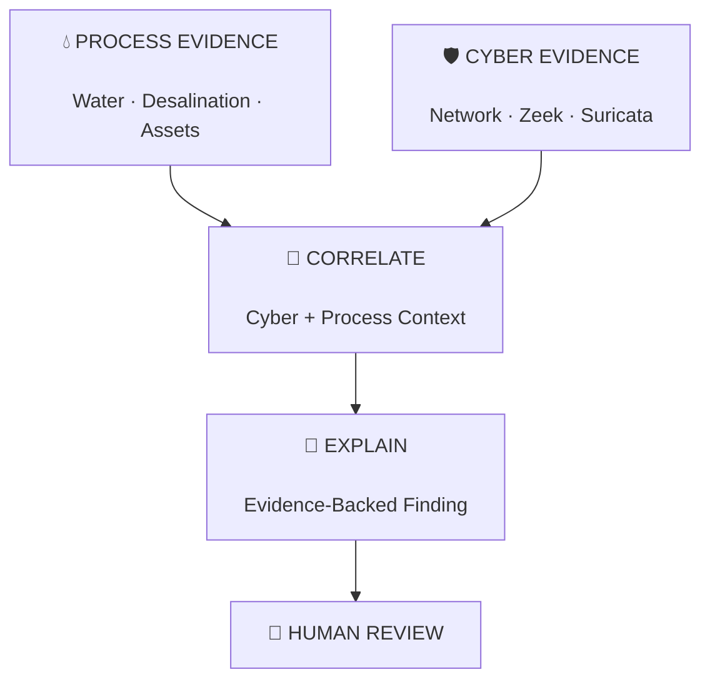
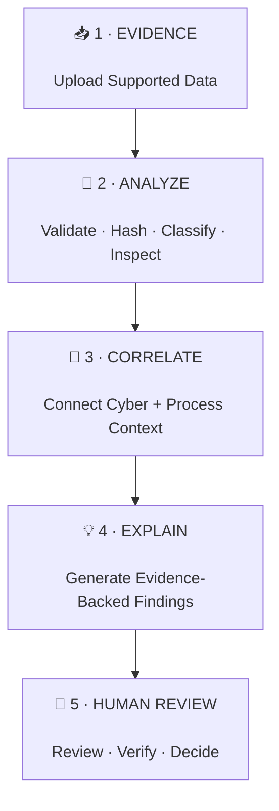
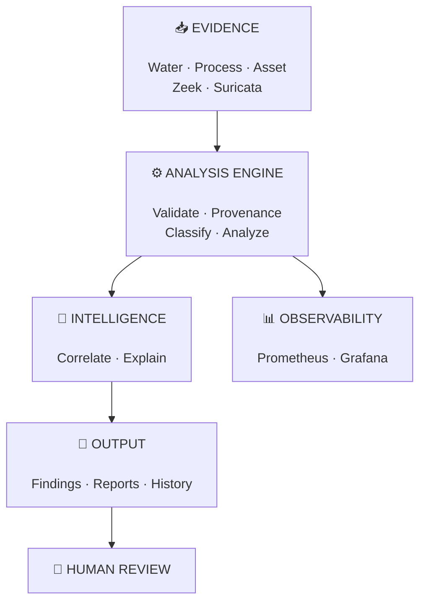
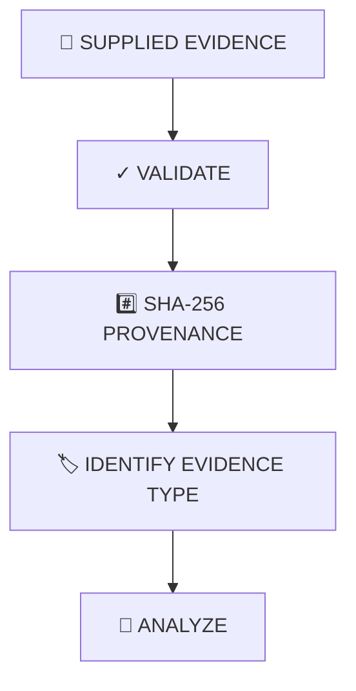
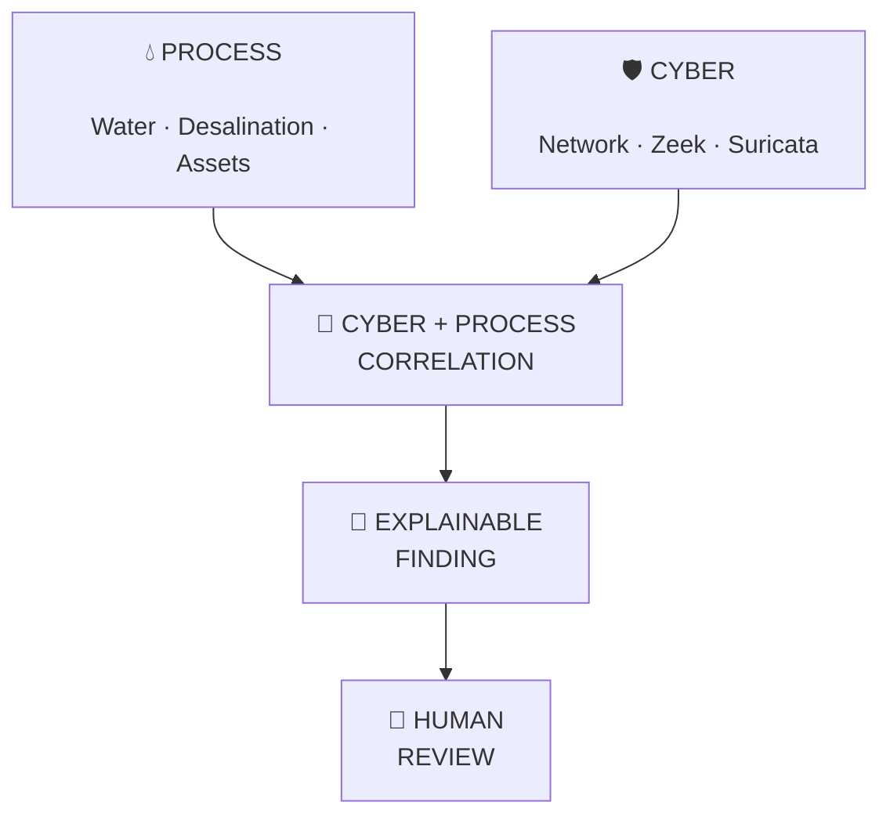
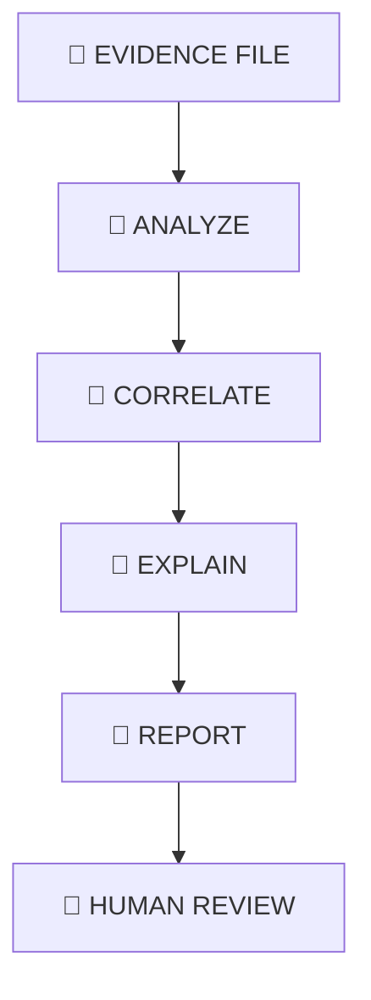
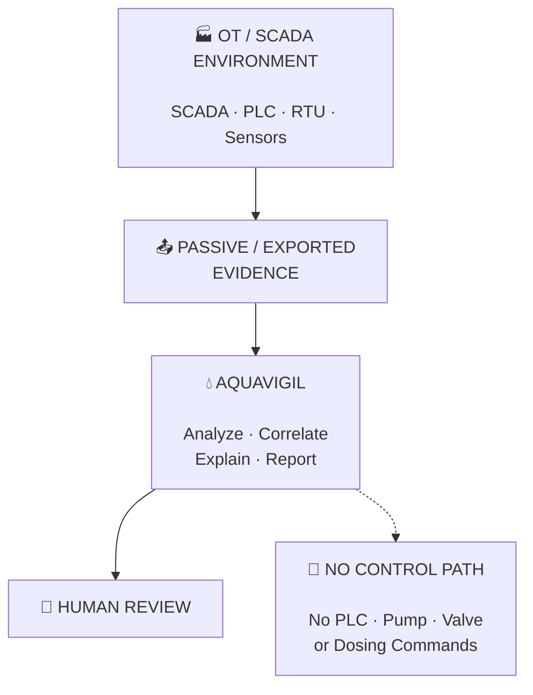
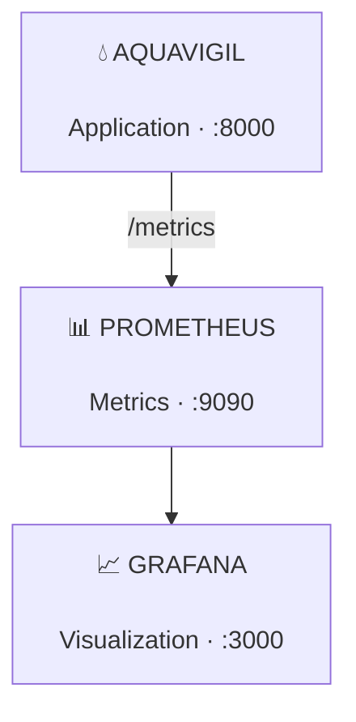

<p align="center">
  
</p>

<h1 align="center">💧 AquaVigil</h1>

<h3 align="center">Smart Water & Desalination Infrastructure Security Platform</h3>

<p align="center">
  <strong>Defensive · Read-Only · Evidence-Driven · Explainable · Observable</strong>
</p>

<p align="center">
  <strong>Evidence First. Water Intelligence Explained.</strong>
</p>

<p align="center">
  
  
  
  
  
  
  
  
</p>

<p align="center">
  <strong>v1.0.0 · Educational Defensive Prototype · Human-in-the-Loop</strong>
</p>

---

## Overview

**AquaVigil** is a defensive water-intelligence and OT/SCADA security workstation that transforms synthetic or safely exported water-quality, desalination, process, asset, and cybersecurity evidence into traceable and explainable defensive intelligence.

Instead of treating operational-process behavior and cybersecurity activity as completely separate problems, AquaVigil brings them together in one evidence-driven workflow.

The platform can:

* validate and normalize supplied evidence;
* calculate SHA-256 provenance;
* identify supported evidence types;
* analyze water-quality and desalination observations;
* provide asset-health context;
* analyze passive OT/SCADA security evidence;
* interpret Zeek-style and Suricata-style evidence;
* correlate cyber and physical-process observations;
* generate explainable findings;
* generate professional reports;
* preserve analysis and report history;
* expose application metrics through Prometheus;
* visualize supported telemetry through Grafana.

AquaVigil ends at:

**Analysis → Explanation → Reporting → Human Review**

It does **not** control industrial infrastructure.

---

## Navigation

[Why AquaVigil](#why-aquavigil) ·
[Core Capabilities](#core-capabilities) ·
[How It Works](#how-aquavigil-works) ·
[Architecture](#platform-architecture) ·
[Intelligence Domains](#intelligence-domains) ·
[Workspaces](#platform-workspaces) ·
[Example Analysis](#example-analysis-journey) ·
[Safety](#otscada-safety-boundary) ·
[Observability](#observability) ·
[Quick Start](#quick-start) ·
[Testing](#developer-setup--testing) ·
[Documentation](#documentation)

---

# Why AquaVigil?

Water and desalination infrastructure combines two important realities:

**Physical-process behavior**

and

**Cybersecurity behavior**

Looking at only one side can remove important context.

A process anomaly may become more significant when relevant cybersecurity evidence appears at the same time.

Likewise, a cybersecurity alert may become more meaningful when process, water-quality, or asset evidence provides additional context.

AquaVigil connects these two evidence domains.



The goal is not simply to generate another alert.

AquaVigil is designed to help answer:

* What was observed?
* Which evidence supports the finding?
* What condition was expected?
* Why was the observation detected?
* Are cyber and process observations related?
* What may require further review?
* What is a safe next step?
* Who retains operational authority?

---

# Core Capabilities

| Capability                   |          Support         |
| ---------------------------- | :----------------------: |
| CSV evidence ingestion       |             ✅            |
| JSON evidence ingestion      |             ✅            |
| JSONL evidence ingestion     |             ✅            |
| File validation              |             ✅            |
| Evidence normalization       |             ✅            |
| SHA-256 provenance           |             ✅            |
| Evidence-type detection      |             ✅            |
| Water-quality analysis       |             ✅            |
| Desalination intelligence    |             ✅            |
| Asset-health reasoning       |             ✅            |
| Passive OT/SCADA analysis    |             ✅            |
| Zeek-style network evidence  |             ✅            |
| Suricata-style IDS evidence  |             ✅            |
| Cyber-process correlation    |             ✅            |
| Explainable findings         |             ✅            |
| Professional reporting       |             ✅            |
| Analysis/report history      |             ✅            |
| Prometheus metrics           |             ✅            |
| Grafana visualization        |             ✅            |
| Docker Compose deployment    |             ✅            |
| Automated testing            |             ✅            |
| GitHub Actions CI            |             ✅            |
| Dependency maintenance       |             ✅            |
| Industrial-control commands  | ❌ Intentionally excluded |
| Autonomous physical response | ❌ Intentionally excluded |

---

# How AquaVigil Works

The complete AquaVigil workflow can be understood in five stages.



### The decision boundary

AquaVigil deliberately separates machine-assisted analysis from operational authority.

```text
Evidence
   ↓
Analysis
   ↓
Explainable Finding
   ↓
Human Review
   ↓
Independent Verification
   ↓
Authorized Decision Outside AquaVigil
```

A detection is **not** automatically converted into an operational action.

---

# Platform Architecture

The platform architecture is intentionally divided into a few understandable layers.



> **Evidence enters AquaVigil. Intelligence leaves AquaVigil. Industrial commands do not.**

Detailed component-level architecture is intentionally kept in:

[`docs/ARCHITECTURE.md`](docs/ARCHITECTURE.md)

---

# Evidence Ingestion & Provenance

AquaVigil accepts supported structured evidence formats.

| Format | Support |
| ------ | :-----: |
| CSV    |    ✅    |
| JSON   |    ✅    |
| JSONL  |    ✅    |

Evidence follows a traceable ingestion path:



SHA-256 provenance maintains a traceable relationship between the original supplied evidence and the analysis produced from it.

```text
Original Evidence
       ↓
SHA-256
       ↓
Analysis
       ↓
Findings
       ↓
Report
```

This supports reproducibility and helps identify which supplied evidence produced a particular analytical result.

Evidence remains **input for analysis**.

It is not automatically treated as proof that a real-world incident occurred.

---

# Intelligence Domains

## 💧 Water Quality

AquaVigil can reason over supported water and process observations involving values such as:

* pH;
* conductivity;
* turbidity;
* chlorine;
* salinity;
* temperature;
* pressure;
* flow.

Supported observations can be compared against expected analytical conditions to produce evidence-backed findings.

AquaVigil does not replace laboratory verification or qualified engineering judgment.

---

## 🌊 Desalination Intelligence

The desalination workspace supports evidence-driven reasoning involving:

* membrane indicators;
* fouling observations;
* feed and process conditions;
* specific-energy indicators;
* demand-oriented analysis;
* operational trends;
* visible decision-support reasoning.

The objective is to expose **why** an observation exists instead of displaying only a status label.

---

## ⚙️ Asset Health

Asset evidence provides additional context for:

* process anomalies;
* water-quality observations;
* desalination findings;
* cybersecurity correlation.

Asset-health output remains decision support.

It does not independently certify the physical condition of real industrial equipment.

---

## 🛡️ OT / SCADA Security

AquaVigil can analyze supplied defensive evidence involving:

* network zones;
* connection context;
* authorization observations;
* security signatures;
* process context;
* asset context;
* passive network evidence;
* security events.

The architecture assumes **passive or safely exported evidence**.

---

## 🌐 Zeek & Suricata

### Zeek-style evidence

Example:

```text
data/zeek_network_evidence.csv
```

Supported evidence can contribute context involving:

* source and destination activity;
* connection behavior;
* protocols;
* services;
* communication patterns.

### Suricata-style evidence

Example:

```text
data/suricata_alerts.json
```

Supported evidence can contribute:

* IDS alerts;
* signature context;
* event metadata;
* network-security observations.

These inputs contribute to defensive analysis.

They do not provide AquaVigil with active network or industrial-control capability.

---

# Cyber-Process Correlation

One of AquaVigil's central ideas is combining cybersecurity evidence with process evidence.



A supported finding can expose information such as:

```text
Observed Evidence
Expected Condition
Detection Method
Potential Impact
Evidence Source
Safe Response
Provenance
```

The important distinction is:

```text
Alert ≠ Conclusion
Finding ≠ Authorized Action
```

AquaVigil provides evidence and context for human review.

---

# Platform Workspaces

| Workspace                   | Purpose                                                     |
| --------------------------- | ----------------------------------------------------------- |
| 📊 **Overview**             | High-level platform, evidence, analysis, and security state |
| 📥 **Analyze Evidence**     | Upload, validate, classify, hash, and analyze evidence      |
| 💧 **Water Quality**        | Water-quality and process observations                      |
| 🌊 **Desalination**         | Membrane, energy, demand, and process reasoning             |
| ⚙️ **Asset Health**         | Evidence-based equipment and asset context                  |
| 🛡️ **OT / SCADA Security** | Passive industrial-security analysis                        |
| 🚨 **Threat Center**        | Security findings and correlated context                    |
| 🌐 **Zeek / Suricata**      | Passive network and IDS evidence                            |
| 📄 **Reports**              | Explainable reporting and audit history                     |

---

# Example Analysis Journey

A demonstration can begin with a bundled synthetic evidence file such as:

```text
data/unexpected_dosing_incident.csv
```

The analysis journey is intentionally simple:



Internally, AquaVigil can perform additional validation, provenance, classification, analytical, and correlation steps.

The user-facing principle remains:

> **Evidence → Analysis → Explanation → Human Review**

---

# OT/SCADA Safety Boundary

This is one of AquaVigil's most important architectural boundaries.

AquaVigil receives evidence from the operational environment.

It does **not** send industrial-control commands back into that environment.



The OT/SCADA components shown above are conceptual context.

They do not represent a real utility topology.

### AquaVigil stops here

```text
OBSERVE
   ↓
ANALYZE
   ↓
EXPLAIN
   ↓
REPORT
   ↓
HUMAN REVIEW
   ↓
STOP
```

There is no AquaVigil path for:

```text
PLC manipulation
SCADA write operations
Pump commands
Valve commands
Chemical-dosing commands
Process setpoint changes
Safety-function manipulation
Autonomous operational response
```

---

# Observability

AquaVigil uses a deliberately simple local observability architecture.



Monitoring is separate from operational control.

## Default Services

| Service               | URL                             |
| --------------------- | ------------------------------- |
| 💧 AquaVigil          | `http://localhost:8000`         |
| 📊 Prometheus         | `http://localhost:9090`         |
| 🎯 Prometheus Targets | `http://localhost:9090/targets` |
| 📈 Grafana            | `http://localhost:3000`         |

Default Grafana credentials:

```text
Username: admin
Password: aquavigil
```

---

# Quick Start

## Requirements

Install:

* Docker Desktop;
* Docker Compose v2;
* Git;
* Windows 10/11;
* a modern browser.

Clone the repository:

```bash
git clone https://github.com/HaziqBinAfzal/AquaVigil.git
cd AquaVigil
```

---

## Windows — Recommended

Start **Docker Desktop** and wait until the Docker engine is ready.

Then double-click:

```text
OPEN-AQUAVIGIL.vbs
```

For visible startup diagnostics:

```text
START-AQUAVIGIL.cmd
```

Or use PowerShell:

```powershell
.\start-aquavigil.ps1
```

The launcher prepares the environment, starts the Docker Compose stack, waits for AquaVigil, and opens the application.

---

# Manual Docker Deployment

Start the complete stack:

```bash
docker compose up --build -d
```

Check container status:

```bash
docker compose ps
```

View logs:

```bash
docker compose logs -f
```

Stop the stack:

```bash
docker compose down
```

## Deployment Model

```text
Browser
   │
   ├── AquaVigil  :8000
   │
   ├── Prometheus :9090
   │
   └── Grafana    :3000
```

The v1.0.0 Compose environment intentionally remains small:

```text
AquaVigil
Prometheus
Grafana
```

---

# Synthetic Evidence Library

Bundled demonstration evidence is stored in:

```text
data/
```

| File                             | Scenario                         |
| -------------------------------- | -------------------------------- |
| `normal_operation.csv`           | Baseline operating evidence      |
| `unexpected_dosing_incident.csv` | Dosing-related process scenario  |
| `quality_excursion.csv`          | Water-quality excursion          |
| `membrane_fouling.csv`           | Desalination / membrane scenario |
| `zeek_network_evidence.csv`      | Passive network evidence         |
| `suricata_alerts.json`           | IDS-style event evidence         |

All bundled scenarios are **synthetic**.

They are intended for safe education, demonstration, development, and testing.

---

# Technology Stack

| Layer                  | Technology                 |
| ---------------------- | -------------------------- |
| Application            | Python 3.12+               |
| Backend                | Flask                      |
| Frontend               | HTML / CSS / JavaScript    |
| Persistence            | SQLite                     |
| Analysis               | Python analytical services |
| Evidence               | CSV / JSON / JSONL         |
| Containerization       | Docker                     |
| Orchestration          | Docker Compose             |
| Metrics                | Prometheus                 |
| Visualization          | Grafana                    |
| Testing                | Pytest                     |
| CI                     | GitHub Actions             |
| Dependency Maintenance | Dependabot                 |
| Version Control        | Git / GitHub               |

---

# Developer Setup & Testing

Docker is recommended for the complete AquaVigil demonstration environment.

For local Python development:

### 1. Create a virtual environment

```powershell
py -3.12 -m venv .venv
```

### 2. Allow activation for the current PowerShell session

```powershell
Set-ExecutionPolicy -Scope Process Bypass
```

### 3. Activate

```powershell
.\.venv\Scripts\Activate.ps1
```

### 4. Install dependencies

```powershell
python -m pip install -r requirements.txt
```

### 5. Run tests

```powershell
pytest -q
```

### 6. Start AquaVigil

```powershell
python run.py
```

The direct Python development server runs at:

```text
http://localhost:5000
```

> Direct Python development does not automatically start Prometheus or Grafana.

---

# DevSecOps & CI

AquaVigil includes automated repository validation and dependency maintenance.

The workflow is intentionally straightforward:

```text
CODE CHANGE
     ↓
GITHUB
     ↓
CI
     ↓
TESTS + VALIDATION
     ↓
PASS / FIX
```

CI workflow:

```text
.github/workflows/ci.yml
```

Dependency configuration:

```text
.github/dependabot.yml
```

---

# Repository Structure

```text
AquaVigil/
│
├── .github/
│   ├── dependabot.yml
│   └── workflows/
│       └── ci.yml
│
├── app/
│   ├── services/
│   │   └── analyzer.py
│   ├── static/
│   │   ├── css/
│   │   └── img/
│   │       └── aquavigil-logo.svg
│   ├── templates/
│   ├── __init__.py
│   ├── db.py
│   ├── metrics.py
│   └── routes.py
│
├── data/
│   ├── membrane_fouling.csv
│   ├── normal_operation.csv
│   ├── quality_excursion.csv
│   ├── suricata_alerts.json
│   ├── unexpected_dosing_incident.csv
│   └── zeek_network_evidence.csv
│
├── docker/
│   ├── grafana/
│   └── prometheus.yml
│
├── docs/
│   ├── ARCHITECTURE.md
│   ├── ARCHITECTURE_CATALOG.md
│   ├── DEMONSTRATION_GUIDE.md
│   ├── FAILURE_RECOVERY.md
│   ├── REQUIREMENT_MATRIX.md
│   └── SECURITY.md
│
├── scripts/
├── tests/
│
├── CHANGELOG.md
├── Dockerfile
├── LICENSE
├── OPEN-AQUAVIGIL.vbs
├── README.md
├── START-AQUAVIGIL.cmd
├── STOP-AQUAVIGIL.cmd
├── docker-compose.yml
├── pytest.ini
├── requirements.txt
└── run.py
```

---

# Architecture Documentation

The README intentionally uses **large and simplified architecture views**.

Detailed engineering architecture is kept separately so the README remains readable.

The full architecture documentation contains 20 technical views:

|  # | Architecture View                      |
| -: | -------------------------------------- |
| 01 | Platform Context                       |
| 02 | End-to-End Evidence Architecture       |
| 03 | Logical Component Architecture         |
| 04 | Water-Quality Analysis Pipeline        |
| 05 | Desalination Intelligence Architecture |
| 06 | Asset-Health Reasoning                 |
| 07 | OT / SCADA Defensive Architecture      |
| 08 | Trust-Zone & Industrial-DMZ Model      |
| 09 | Passive Monitoring Architecture        |
| 10 | Cyber-Process Correlation              |
| 11 | Anomaly-Analysis Architecture          |
| 12 | Reporting & Audit Architecture         |
| 13 | Observability Architecture             |
| 14 | Docker Deployment Architecture         |
| 15 | Application Data Stores                |
| 16 | Safety-Boundary Architecture           |
| 17 | Failure & Recovery Architecture        |
| 18 | CI & Quality-Gate Architecture         |
| 19 | Conceptual Water-Process Context       |
| 20 | Human Decision Architecture            |

Full technical architecture:

[`docs/ARCHITECTURE.md`](docs/ARCHITECTURE.md)

Architecture catalog:

[`docs/ARCHITECTURE_CATALOG.md`](docs/ARCHITECTURE_CATALOG.md)

---

# Documentation

| Document                                               | Purpose                                           |
| ------------------------------------------------------ | ------------------------------------------------- |
| [`Architecture`](docs/ARCHITECTURE.md)                 | Complete architecture and data-flow documentation |
| [`Architecture Catalog`](docs/ARCHITECTURE_CATALOG.md) | Index of architecture views                       |
| [`Demonstration Guide`](docs/DEMONSTRATION_GUIDE.md)   | Guided AquaVigil demonstration                    |
| [`Requirement Matrix`](docs/REQUIREMENT_MATRIX.md)     | Requirement-to-evidence mapping                   |
| [`Security`](docs/SECURITY.md)                         | Defensive boundaries and security considerations  |
| [`Failure & Recovery`](docs/FAILURE_RECOVERY.md)       | Troubleshooting and recovery guidance             |
| [`Changelog`](CHANGELOG.md)                            | Version history                                   |

---

# Security & Safety Boundary

> ### 🛡️ Defensive by Design
>
> AquaVigil is a **read-only educational defensive demonstrator**.
>
> Bundled demonstration evidence is synthetic.
>
> **AquaVigil has no industrial-control authority.**

The complete boundary can be summarized as:

```text
Evidence
   ↓
Analyze
   ↓
Correlate
   ↓
Explain
   ↓
Report
   ↓
Human Review
   ↓
STOP
```

### Designed for

```text
✓ Passive evidence
✓ Read-only analysis
✓ Evidence provenance
✓ Water/process reasoning
✓ Defensive OT analysis
✓ Cyber-process correlation
✓ Explainable findings
✓ Auditability
✓ Defensive monitoring
✓ Human authority
✓ Synthetic demonstrations
```

### Intentionally excluded

```text
✗ PLC manipulation
✗ SCADA write operations
✗ Pump-control commands
✗ Valve-control commands
✗ Chemical-dosing commands
✗ Process setpoint changes
✗ Safety-function manipulation
✗ Production utility credentials
✗ Real utility topology
✗ Autonomous operational response
```

**Human authority remains the final decision boundary.**

For the complete safe-use model, see:

[`docs/SECURITY.md`](docs/SECURITY.md)

---

# Standards & Assurance Scope

AquaVigil can organize analytical context relevant to water-safety and industrial cybersecurity concepts.

Evidence-oriented mappings may relate to areas such as:

* WHO water-safety concepts;
* EPA water-quality guidance;
* applicable national water-safety requirements;
* NIST SP 800-82 industrial-control-system security guidance.

> **Framework mapping does not mean certification.**

AquaVigil does not certify:

* regulatory compliance;
* laboratory validity;
* engineering approval;
* the safety of a real utility;
* the security state of a real utility.

Real-world decisions remain the responsibility of qualified organizations and authorized personnel.

---

# Responsible AI Disclosure

AI tools assisted with portions of:

* code development;
* documentation;
* testing support;
* architecture development;
* interface development;
* original visual development.

AquaVigil emphasizes:

```text
Evidence
   +
Visible Analytical Methods
   +
Provenance
   +
Correlation Logic
   +
Expected Conditions
   ↓
Explainable Decision Support
```

AquaVigil does **not** represent a validated production water-sector AI system.

AI-assisted analysis does not replace human authority.

---

# Demonstration Path

A simple technical or academic demonstration can follow this sequence:

1. Introduce AquaVigil and the read-only safety boundary.
2. Explain the evidence-to-decision workflow.
3. Open **Analyze Evidence**.
4. Select a bundled synthetic scenario.
5. Upload the evidence.
6. Review evidence-type detection and SHA-256 provenance.
7. Inspect process observations and explainable findings.
8. Review **Water Quality**, **Desalination**, and **Asset Health**.
9. Open **OT / SCADA Security** and **Threat Center**.
10. Inspect **Zeek / Suricata** evidence.
11. Generate and review the professional report.
12. Open **Prometheus** and **Grafana**.
13. Finish with the passive-monitoring and human-authority boundary.

---

# Limitations

AquaVigil v1.0.0 is an **educational defensive prototype**.

Its output is not:

```text
✗ Laboratory certification
✗ Engineering approval
✗ Regulatory certification
✗ Legal advice
✗ Authorization to operate infrastructure
✗ Independent water-quality verification
✗ A replacement for qualified operators
✗ A safety-system controller
```

A production deployment would require a separately engineered and authorized architecture involving areas such as:

* authenticated access;
* identity and RBAC;
* encrypted secret management;
* hardened gateways;
* controlled evidence transfer;
* validated engineering limits;
* independent water-quality verification;
* resilient infrastructure;
* managed persistence;
* formal change control;
* site-specific risk assessment;
* cybersecurity governance;
* independent safety and security review;
* qualified operational personnel.

These capabilities are outside the v1.0.0 educational prototype.

---

# Project Status

```text
Project        AquaVigil
Version        1.0.0
Type           Educational Defensive Prototype
Architecture   Read-Only / Evidence-Driven
Deployment     Docker Compose
Application    Flask / Python
Observability  Prometheus + Grafana
License        MIT
```

---

# Contributors

### Haziq Afzal

**Co-Founder, HR Presents**

Project author focused on defensive cybersecurity, DevOps, cloud, containerization, OT/SCADA security, water-infrastructure security, and evidence-driven technology platforms.

GitHub: [@HaziqBinAfzal](https://github.com/HaziqBinAfzal)

### Ruveeha Ashfaq

**Co-Founder, HR Presents · Contributor**

Contributor to AquaVigil's development and project evolution.

GitHub: [@ruveeha33](https://github.com/ruveeha33)

---

# License

AquaVigil is released under the **MIT License**.

See [`LICENSE`](LICENSE).

---

<p align="center">
  
</p>

<h2 align="center">💧 AquaVigil</h2>

<p align="center">
  <strong>Evidence First. Water Intelligence Explained.</strong>
</p>

<p align="center">
  Defensive · Read-Only · Evidence-Driven · Explainable · Observable
</p>

<p align="center">
  <strong>Evidence → Analyze → Correlate → Explain → Human Review</strong>
</p>

<p align="center">
  <strong>v1.0.0</strong>
</p>
