<div align="center">


# AquaVigil

### Smart Water & Desalination Infrastructure Security Platform

**Evidence-driven water intelligence • OT/SCADA protection • explainable analysis • observability**

[](CHANGELOG.md)
[](requirements.txt)
[](docker-compose.yml)
[](https://github.com/HaziqBinAfzal/AquaVigil/actions/workflows/ci.yml)
[](LICENSE)

</div>

## Quick Start

**Windows 10/11 + Docker Desktop**

1. Download the latest AquaVigil release and **extract the ZIP completely**.
2. Start **Docker Desktop** and wait until the Docker engine is running.
3. Open the extracted AquaVigil folder.
4. Double-click `OPEN-AQUAVIGIL.vbs`.
5. When startup completes, open `http://localhost:8000`.

For visible startup diagnostics, use `START-AQUAVIGIL.cmd` instead.

After launch:

| Service | Address |
|---|---|
| **AquaVigil** | `http://localhost:8000` |
| **Grafana** | `http://localhost:3000` |
| **Prometheus** | `http://localhost:9090` |

> New installation? See [Installation and running AquaVigil](#installation-and-running-aquavigil) below for prerequisites, installation location, Git clone instructions, macOS/Linux steps, and troubleshooting.

> [!IMPORTANT]
> **Safety boundary:** AquaVigil is a defensive, read-only educational prototype. All bundled evidence is synthetic. It must never be connected directly to a real utility, SCADA network, controller, pump, valve, dosing system, or safety function.

## Overview

AquaVigil brings water-quality assurance, desalination insight, OT/SCADA security correlation, asset monitoring, explainable decision support, observability, and professional reporting into one workstation. The workflow begins with evidence supplied by the user; AquaVigil validates and classifies that evidence, analyzes operational and security signals, correlates findings, and presents traceable results without issuing commands to operational technology.

## Platform workflow

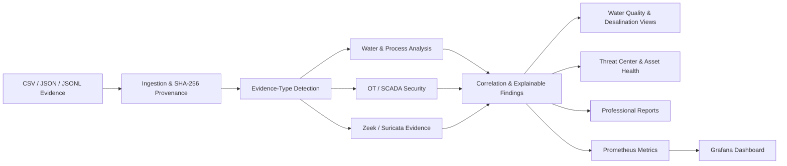

## Complete Architecture Gallery

The following **20 architecture views** document AquaVigil from evidence ingestion through water intelligence, OT/SCADA security, observability, reporting, safety boundaries, and human decision authority.

> **Safety boundary:** These diagrams describe AquaVigil's defensive, read-only educational architecture. They do not represent authorization to connect to or control real water utilities, PLCs, SCADA systems, pumps, valves, dosing systems, or safety functions.

## 1. Platform context

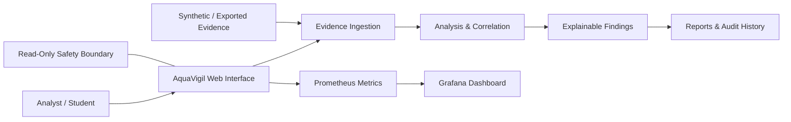

AquaVigil accepts exported evidence, validates it, analyzes water/process and cybersecurity observations, correlates findings, and presents traceable results. It does not send operational commands.

## 2. End-to-end evidence architecture

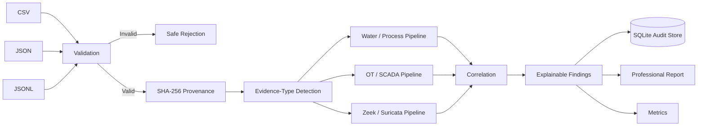

## 3. Logical component architecture

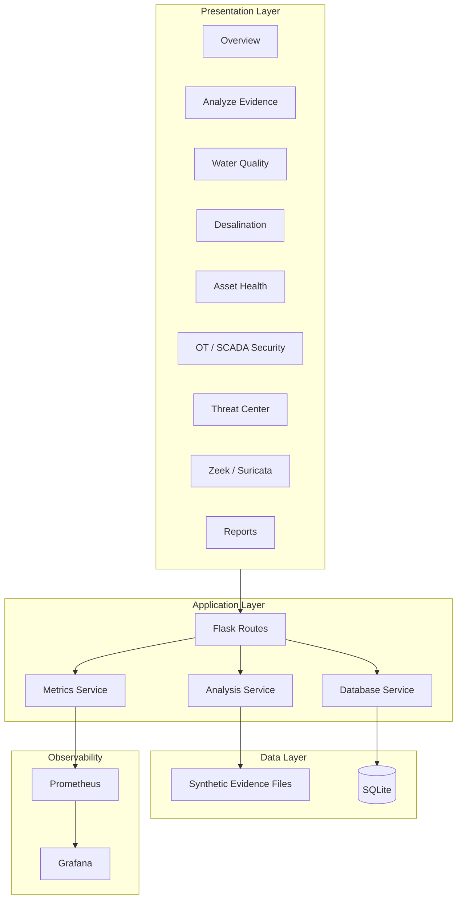

## 4. Water-quality analysis pipeline

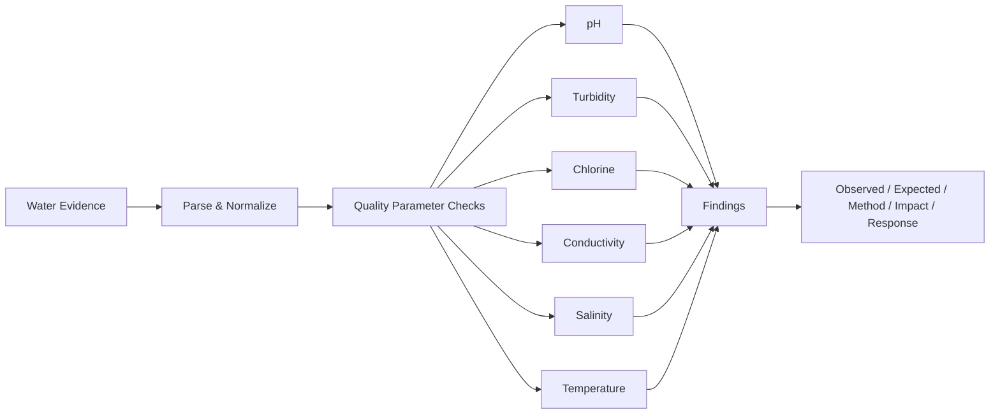

## 5. Desalination intelligence architecture

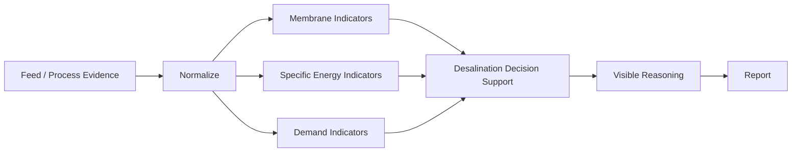

## 6. Asset-health reasoning

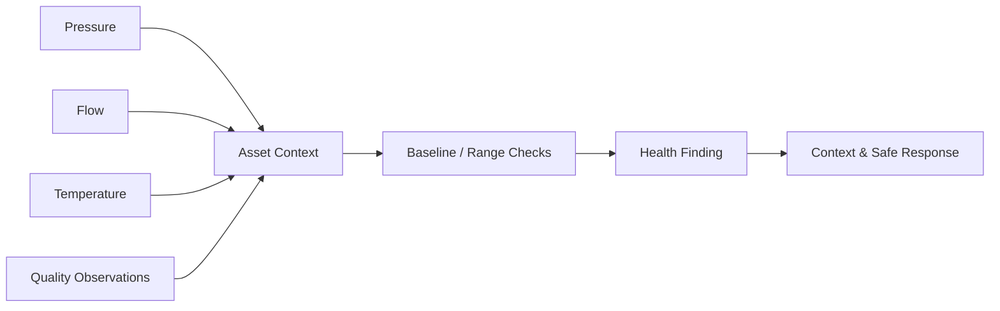

## 7. OT / SCADA defensive architecture

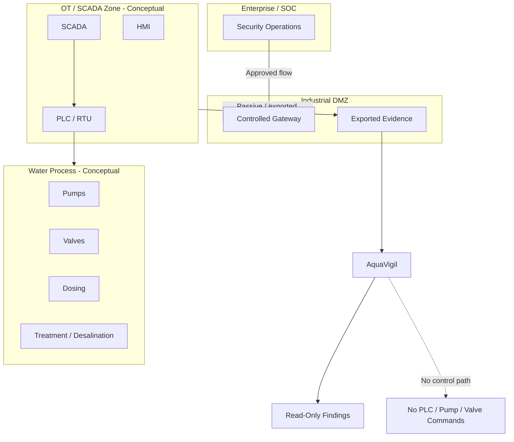

## 8. Trust-zone and industrial-DMZ model

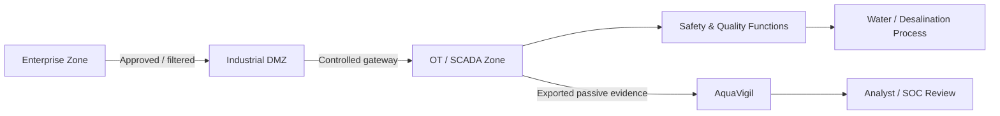

There is deliberately no direct AquaVigil-to-process command path.

## 9. Passive monitoring architecture

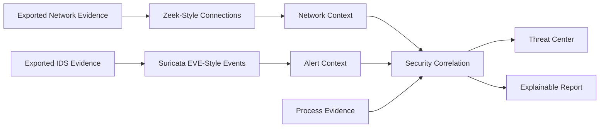

## 10. Cyber-process correlation

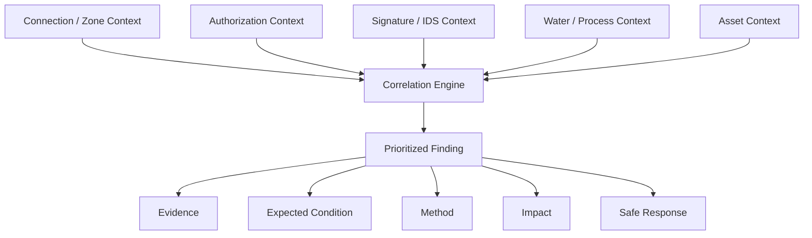

## 11. Anomaly-analysis architecture

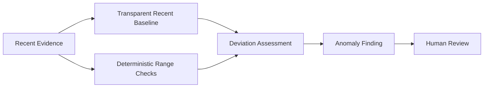

AquaVigil's anomaly layer is decision support, not autonomous process control.

## 12. Reporting and audit architecture

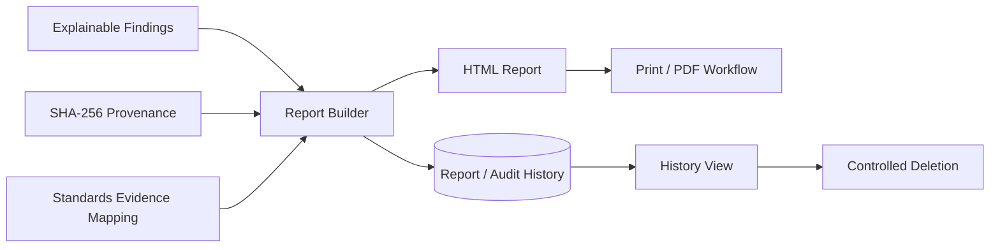

## 13. Observability architecture

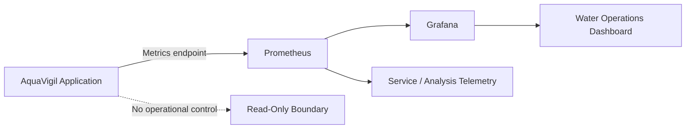

## 14. Docker deployment architecture

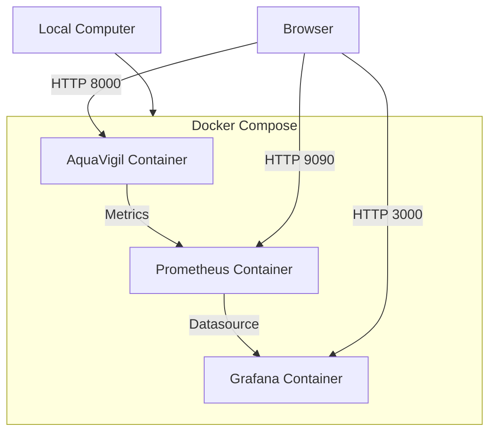

## 15. Application data stores

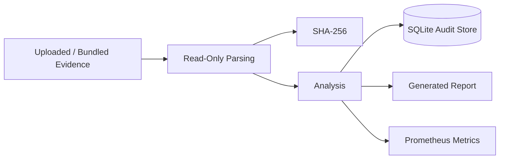

## 16. Safety-boundary architecture

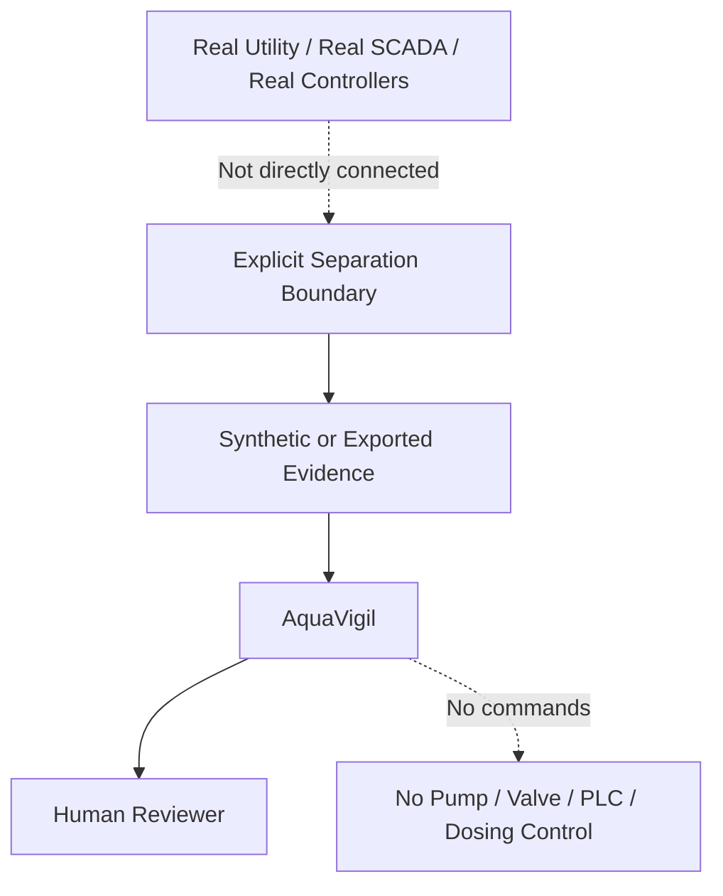

## 17. Failure and recovery architecture

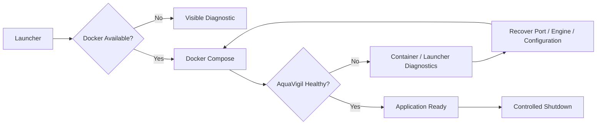

## 18. CI and quality-gate architecture

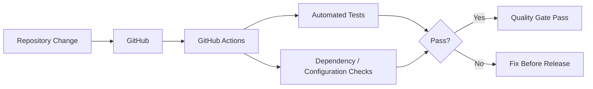

## 19. Conceptual water-process context

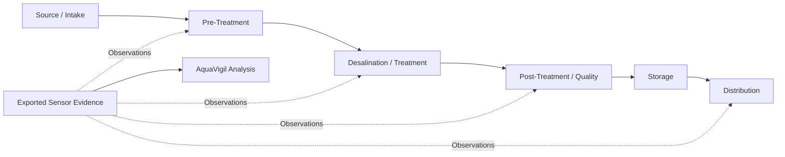

This diagram is conceptual and does not represent a real facility topology.

## 20. Human decision architecture

```mermaid
flowchart LR
    E[Evidence] --> A[AquaVigil Analysis]
    A --> F[Explainable Finding]
    F --> H[Human Review]
    H --> V[Independent Verification]
    V --> D[Authorized Operational Decision Outside AquaVigil]
```

AquaVigil ends at evidence-backed decision support. Operational authority remains outside the application.

### Detailed architecture documentation

- [Complete Architecture Documentation](docs/ARCHITECTURE.md)
- [Architecture Catalog](docs/ARCHITECTURE_CATALOG.md)

## Core capabilities

| Domain | What AquaVigil demonstrates |
|---|---|
| **Evidence assurance** | CSV, JSON and JSONL ingestion, SHA-256 provenance, automatic evidence-type detection |
| **Water intelligence** | pH, conductivity, turbidity, chlorine, salinity, pressure, flow and temperature analysis |
| **Anomaly analysis** | Deterministic operating-range checks and a transparent recent-baseline anomaly model |
| **OT / SCADA protection** | Authorization, zone, connection, signature and process-context correlation |
| **Passive monitoring** | Zeek-style connection evidence and Suricata EVE-style security events |
| **Desalination insight** | Fouling, specific-energy and daily-demand decision support with visible reasoning |
| **Explainability** | Findings show observed evidence, expected condition, method, impact, source and safe response |
| **Reporting** | Report history, provenance, print/PDF workflow, HTML export and controlled deletion |
| **Observability** | Prometheus telemetry plus a provisioned Grafana water-operations dashboard |
| **Standards evidence** | Mapping to WHO water-safety concepts, EPA guidance, national water-safety requirements and NIST SP 800-82 |

## Interface

AquaVigil's workspace is organized around the operational workflow:

**Overview → Analyze Evidence → Water Quality → Desalination → Asset Health → OT / SCADA Security → Threat Center → Zeek / Suricata → Reports**

The repository includes the AquaVigil visual assets and complete responsive web interface.

## Installation and running AquaVigil

AquaVigil is designed to run locally on your computer. **Windows 10/11 with Docker Desktop is the recommended setup.** You do not need to install AquaVigil into a special system directory.

### 1. Prerequisites

Before installing AquaVigil, install:

- **Docker Desktop** — required for the recommended full-stack deployment.
- **Git** — only required if you want to clone the repository instead of downloading the ZIP.
- A modern web browser such as Microsoft Edge, Chrome, or Firefox.

For the full Docker deployment, Python does **not** need to be installed separately.

### 2. Where to install AquaVigil

Choose a normal user-writable folder. Recommended examples:

```text
C:\Users\<your-user>\Documents\AquaVigil
```

or:

```text
C:\Users\<your-user>\Downloads\AquaVigil
```

> [!IMPORTANT]
> If you download AquaVigil as a ZIP file, **extract the ZIP completely before running it**. Do not launch `OPEN-AQUAVIGIL.vbs`, `START-AQUAVIGIL.cmd`, or `start-aquavigil.ps1` from inside the compressed ZIP preview or a temporary extraction window.

### 3. Download AquaVigil

#### Option A — Download the release ZIP

1. Open the GitHub **Releases** page.
2. Select **AquaVigil v1.0.0**.
3. Download **Source code (zip)**.
4. Right-click the downloaded ZIP and choose **Extract All**.
5. Open the extracted AquaVigil folder.

#### Option B — Clone with Git

Open PowerShell in the folder where you want AquaVigil and run:

```powershell
git clone https://github.com/HaziqBinAfzal/AquaVigil.git
cd AquaVigil
```

### 4. Start Docker Desktop

Open Docker Desktop and wait until the Docker engine reports that it is running.

AquaVigil uses three local services:

| Service | Address | Purpose |
|---|---|---|
| AquaVigil | `http://localhost:8000` | Main application |
| Grafana | `http://localhost:3000` | Observability dashboard |
| Prometheus | `http://localhost:9090` | Metrics and monitoring |

Default Grafana credentials are `admin` / `aquavigil`.

### 5. Run AquaVigil on Windows — recommended

Inside the extracted or cloned AquaVigil folder, double-click:

```text
OPEN-AQUAVIGIL.vbs
```

The launcher prepares the environment, starts the Docker Compose stack, waits for AquaVigil to become healthy, and opens the application in your browser.

If you want to see startup diagnostics instead, double-click:

```text
START-AQUAVIGIL.cmd
```

You can also start it directly from PowerShell:

```powershell
.\start-aquavigil.ps1
```

### 6. Verify the installation

After startup, open:

```text
AquaVigil:  http://localhost:8000
Grafana:    http://localhost:3000
Prometheus: http://localhost:9090
```

For an additional Docker check, run:

```powershell
docker compose ps
```

The AquaVigil, Prometheus, and Grafana services should be running.

### 7. Start manually with Docker Compose

If you do not want to use the Windows launcher:

```powershell
Copy-Item .env.example .env -ErrorAction SilentlyContinue
docker compose pull prometheus grafana
docker compose up --build -d
docker compose ps
```

Then open `http://localhost:8000`.

### 8. Stop AquaVigil

On Windows, double-click:

```text
STOP-AQUAVIGIL.cmd
```

Or use:

```powershell
docker compose down
```

### macOS / Linux

Clone or extract AquaVigil, open a terminal in the project directory, and run:

```bash
chmod +x start-aquavigil.sh stop-aquavigil.sh
./start-aquavigil.sh
```

Stop the stack with:

```bash
./stop-aquavigil.sh
```

### Troubleshooting startup

If AquaVigil does not start:

1. Confirm Docker Desktop is running.
2. Confirm the project was fully extracted from the ZIP.
3. Run `START-AQUAVIGIL.cmd` instead of the silent launcher so the error remains visible.
4. Check `docker compose ps`.
5. Make sure ports `8000`, `3000`, and `9090` are not already occupied by another application or container.
6. Review [Failure & Recovery](docs/FAILURE_RECOVERY.md) for additional recovery guidance.

## Local Python development

```powershell
py -3.12 -m venv .venv
Set-ExecutionPolicy -Scope Process Bypass
.\.venv\Scripts\Activate.ps1
python -m pip install -r requirements.txt
pytest -q
python run.py
```

The local Python route runs the web application at `http://localhost:5000`; it does not start Prometheus or Grafana.

## Synthetic evidence library

Bundled demonstration files live in `data/` and can also be accessed from **Analyze Evidence**:

- `normal_operation.csv` — baseline operating evidence
- `unexpected_dosing_incident.csv` — dosing-related process scenario
- `quality_excursion.csv` — water-quality excursion
- `membrane_fouling.csv` — desalination/membrane scenario
- `zeek_network_evidence.csv` — passive network evidence
- `suricata_alerts.json` — IDS-style event evidence

All bundled scenarios are synthetic and are intended for safe demonstration and testing.

## Repository structure

```text
.github/             CI and dependency-update automation
app/                 Flask application, analysis engine, templates, UI and metrics
data/                Synthetic process, water, Zeek-style and Suricata evidence
docker/              Prometheus and Grafana configuration
docs/                Architecture, security, recovery, requirements and demo guidance
scripts/             Setup/support scripts
tests/               Analyzer and application tests
Dockerfile           AquaVigil application image
docker-compose.yml   AquaVigil + Prometheus + Grafana stack
```

## Documentation

| Document | Purpose |
|---|---|
| [Architecture](docs/ARCHITECTURE.md) | System structure and data flow |
| [Demonstration Guide](docs/DEMONSTRATION_GUIDE.md) | Guided project demonstration |
| [Requirement Matrix](docs/REQUIREMENT_MATRIX.md) | Requirement-to-evidence mapping |
| [Security](docs/SECURITY.md) | Defensive boundaries and security considerations |
| [Failure & Recovery](docs/FAILURE_RECOVERY.md) | Recovery and troubleshooting guidance |
| [Changelog](CHANGELOG.md) | Version history |

## Demonstration path

1. Start with the safety boundary and architecture.
2. Upload one of the synthetic evidence samples.
3. Review evidence detection, provenance and sensor/network observations.
4. Inspect explainable findings across water/process and security contexts.
5. Review desalination decision support and asset-health reasoning.
6. Generate the professional report and inspect standards evidence mapping.
7. Open Prometheus and Grafana to demonstrate observability.
8. Discuss passive monitoring, segmentation, the industrial DMZ and recovery controls.

## Testing and automation

Run the automated tests with:

```bash
pytest -q
```

GitHub Actions provides repository CI, while Dependabot tracks supported dependency updates. Docker configuration keeps the application, Prometheus and Grafana deployment reproducible.

## Design principles

AquaVigil is built around four boundaries:

- **Read-only by design:** analysis and visualization, not operational control.
- **Evidence before claims:** findings are tied to supplied evidence and provenance.
- **Explainability:** detections expose the condition and reasoning behind the finding.
- **Safe demonstration:** bundled datasets are synthetic and separated from real infrastructure.

## Limitations

AquaVigil is an educational defensive prototype. Its output is not laboratory certification, engineering approval, legal advice, formal regulatory certification, or authorization to operate critical infrastructure. Real-world deployment would require explicit authorization, secure architecture, authenticated access, independent water-quality verification, validated engineering limits, change control, and qualified operators.

## License

Released under the [MIT License](LICENSE).

---

<div align="center">

**AquaVigil v1.0.0 — defensive water intelligence with an explicit OT safety boundary.**

</div>
