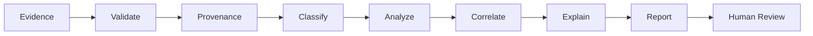
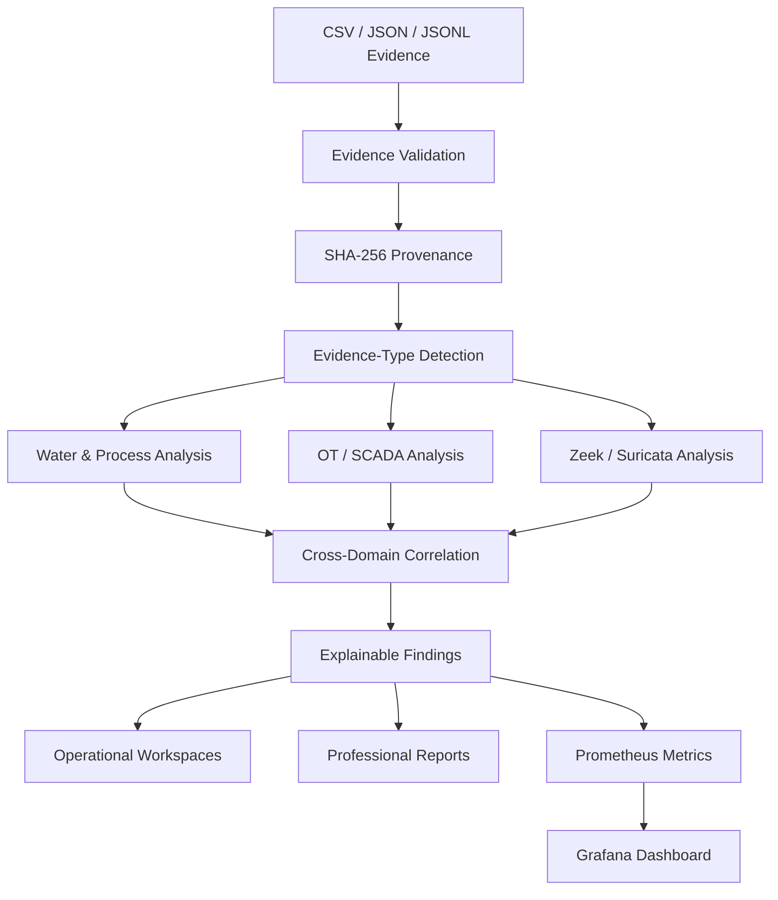
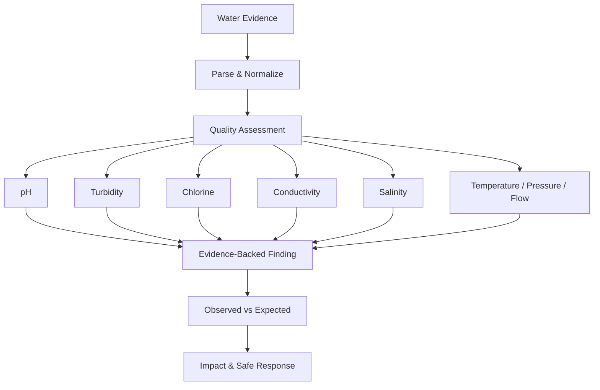
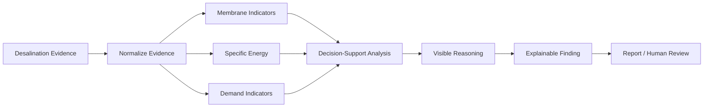
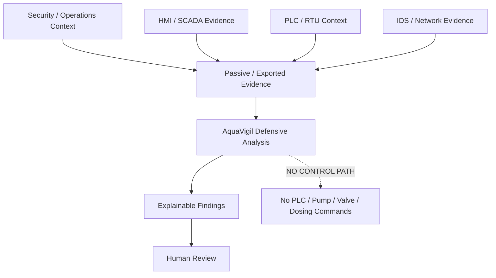
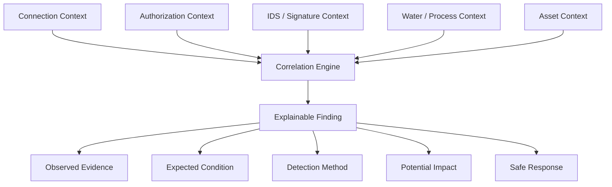
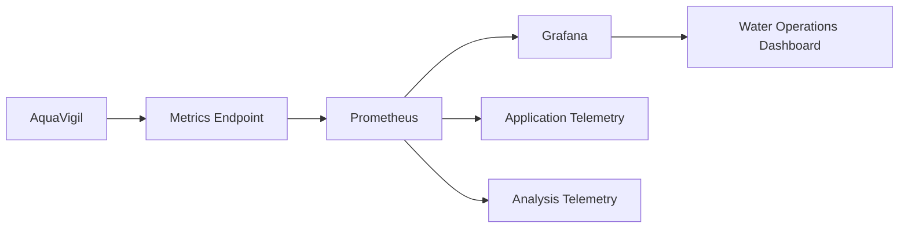

<p align="center">
  
</p>

# 💧 AquaVigil

### Smart Water & Desalination Infrastructure Security Platform

**Defensive · Read-Only · Evidence-Driven · Explainable · Observable**

**Version 1.0.0**

AquaVigil is a defensive water-intelligence and OT/SCADA security workstation that transforms synthetic or safely exported water-quality, desalination, process, asset, and cybersecurity evidence into explainable findings, correlated intelligence, professional reports, and observable human decision support — without sending commands to operational technology.


---

## 🛡️ Safety Authority

> **AquaVigil is a defensive, read-only educational demonstrator.**
>
> All bundled demonstration evidence is synthetic.
>
> AquaVigil has **no industrial-control capability** and must never be connected directly to a real water utility, SCADA network, PLC, RTU, pump, valve, chemical-dosing system, safety function, or production operational environment.

### READ-ONLY BOUNDARY

**Observe → Validate → Analyze → Correlate → Explain → Report**

**Human authority remains the final decision boundary.**

---

# 🚀 Quick Start

## Requirements

Before running AquaVigil, install:

- Docker Desktop
- Docker Compose v2
- Git
- Windows 10/11
- A modern web browser

Clone the repository:

```bash
git clone https://github.com/HaziqBinAfzal/AquaVigil.git
cd AquaVigil
```

### Windows — Recommended

Start **Docker Desktop** and wait until the Docker engine is running.

Then double-click:

```text
OPEN-AQUAVIGIL.vbs
```

For visible startup diagnostics, use:

```text
START-AQUAVIGIL.cmd
```

Or start AquaVigil from PowerShell:

```powershell
.\start-aquavigil.ps1
```

The launcher prepares the environment, starts the Docker Compose stack, waits for AquaVigil to become available, and opens the application in the browser.

---

# 🔄 AquaVigil Workflow

AquaVigil follows an **evidence-to-decision-support** model.



### Evidence → Analysis → Explanation → Human Decision

AquaVigil does not turn a detection directly into an operational action.

Instead, it preserves the separation between:

**machine-assisted analysis** and **human authority**.

---

# 🧠 How AquaVigil Works

AquaVigil combines water/process evidence and defensive cybersecurity evidence inside one traceable workflow.



The analysis begins with evidence supplied by the user.

AquaVigil validates and classifies the evidence, evaluates supported observations, correlates relevant signals, and presents traceable results.

---

# 🎯 What AquaVigil Does

AquaVigil turns passive water, process, asset, and cybersecurity evidence into a structured defensive-analysis workflow.

It is designed to answer:

> **What was observed?**

> **Which evidence supports the finding?**

> **What condition was expected?**

> **How was the observation detected?**

> **Are cyber and process observations related?**

> **What may require human review?**

> **What is a safe next step?**

> **Who retains operational authority?**

The platform focuses on **defensible evidence and explainable decision support**, not autonomous operational response.

---

# 🏗️ Platform Architecture

AquaVigil separates evidence ingestion, analysis, correlation, reporting, observability, and operational authority.

```mermaid
flowchart TB
    U["Analyst / Student"]
    E["Synthetic / Safely Exported Evidence"]

    U --> UI["AquaVigil Web Interface"]
    E --> ING["Evidence Ingestion"]
    UI --> ING

    ING --> ANA["Analysis Engine"]
    ANA --> COR["Correlation Engine"]
    COR --> FIND["Explainable Findings"]

    FIND --> W["Operational Workspaces"]
    FIND --> R["Reports & History"]
    FIND --> M["Metrics"]

    M --> P["Prometheus"]
    P --> G["Grafana"]

    FIND --> H["Human Review"]
```



AquaVigil ends at analysis, explanation, reporting, and human review.

It does not operate the underlying industrial process.

---

# 📥 Evidence Ingestion

AquaVigil accepts defensive evidence in supported structured formats.

| Format | Support |
|---|---|
| CSV | ✅ |
| JSON | ✅ |
| JSONL | ✅ |

The ingestion workflow follows:

```text
Upload
   ↓
File Validation
   ↓
Parsing
   ↓
Normalization
   ↓
SHA-256 Provenance
   ↓
Evidence-Type Detection
   ↓
Analysis
```

Evidence can represent water/process observations, desalination scenarios, asset information, passive network evidence, or security events.

Evidence is treated as **input for analysis**, not as proof that a real-world event occurred.

---

# 🔐 Evidence Provenance

AquaVigil calculates SHA-256 provenance for supplied evidence.

This helps preserve a traceable relationship between:

```text
Original Evidence
       ↓
SHA-256 Provenance
       ↓
Analysis
       ↓
Findings
       ↓
Report
```

Provenance supports reproducibility and helps identify which evidence produced a particular analysis.

---

# 💧 Water Quality Intelligence

AquaVigil provides evidence-driven analysis for supported water-quality and process observations.

Relevant evidence can include:

- pH
- conductivity
- turbidity
- chlorine
- salinity
- temperature
- pressure
- flow



AquaVigil provides decision-support analysis.

It does not replace independent laboratory verification, engineering validation, or qualified operational judgment.

---

# 🌊 Desalination Intelligence

AquaVigil includes a dedicated desalination workspace for interpreting supplied process evidence.

Supported reasoning can include:

- membrane-related indicators;
- fouling observations;
- feed/process conditions;
- specific-energy indicators;
- demand-oriented analysis;
- operational trends;
- visible decision-support reasoning.



The purpose is not simply to produce a status.

AquaVigil is designed to show **why an observation exists and which evidence contributed to it**.

---

# 🛡️ OT / SCADA Protection

AquaVigil includes a defensive OT/SCADA security workspace.

The platform can review supplied evidence involving:

- network zones;
- connection context;
- authorization observations;
- security signatures;
- process context;
- asset context;
- passive network evidence;
- security events.



The architecture assumes **passive or safely exported evidence**.

AquaVigil does not write PLC logic, modify setpoints, control field devices, or issue industrial commands.

---

# 🌐 Zeek & Suricata Evidence

AquaVigil supports passive network-security evidence inspired by common Zeek and Suricata formats.

## Zeek-Style Evidence

Bundled example:

```text
data/zeek_network_evidence.csv
```

Zeek-style evidence can contribute context such as:

- source and destination information;
- connection behavior;
- protocols;
- services;
- communication patterns.

## Suricata-Style Evidence

Bundled example:

```text
data/suricata_alerts.json
```

Suricata-style evidence can contribute:

- IDS alerts;
- signature context;
- event metadata;
- network-security observations.

These inputs support defensive analysis and correlation.

They do not provide active network or industrial-control capability.

---

# 🔗 Cyber-Process Correlation

One of AquaVigil's central goals is to evaluate cybersecurity observations alongside relevant process context.



This helps AquaVigil explain not only **what was observed**, but also **why the observation may deserve review**.

---

# 🧠 Explainable Analysis

AquaVigil avoids presenting findings as unexplained alerts.

A finding can communicate:

```text
Observed Evidence
Expected Condition
Detection Method
Potential Impact
Evidence Source
Safe Response
Provenance
```

The platform is designed to answer:

**What happened?**

**Why was it detected?**

**Which evidence supports it?**

**What should be reviewed next?**

A finding represents an analytical result.

It does not automatically establish that a real-world attack, equipment failure, or water-quality incident occurred.

---

# 🖥️ AquaVigil Workspaces

## 📊 Overview

Provides a high-level view of AquaVigil's operational and analytical state.

The overview can surface:

- evidence activity;
- recent analysis;
- water/process observations;
- security context;
- platform status;
- analysis summaries.

---

## 📥 Analyze Evidence

The primary entry point for analysis.

Users can:

- upload supported evidence;
- use bundled synthetic scenarios;
- inspect evidence detection;
- review provenance;
- run analysis;
- inspect resulting findings.

---

## 💧 Water Quality

Provides water-quality-oriented analysis and evidence views.

It helps organize supported observations involving water parameters and process context.

---

## 🌊 Desalination

Provides desalination-specific decision support.

The workspace presents membrane, energy, demand, and related process reasoning where supported by the supplied evidence.

---

## ⚙️ Asset Health

Provides evidence-based asset-health reasoning.

Asset observations can contribute context to:

- process anomalies;
- water-quality observations;
- desalination findings;
- cybersecurity correlation.

The workspace does not independently certify the physical condition of real equipment.

---

## 🛡️ OT / SCADA Security

Provides a defensive view of industrial-control-oriented evidence.

The workspace is **passive and read-only**.

It does not:

- write PLC logic;
- issue SCADA commands;
- modify setpoints;
- operate pumps;
- operate valves;
- change dosing;
- manipulate physical processes.

---

## 🚨 Threat Center

Provides a security-oriented view of detected or supplied evidence.

The Threat Center helps organize cybersecurity observations for human review alongside relevant process context.

---

## 🌐 Zeek / Suricata

Provides passive network-security evidence views.

These views help demonstrate how network observations and IDS-style events can contribute to broader cyber-process analysis.

---

## 📄 Reports

Transforms analysis results into structured professional reports.

Reports can include:

- evidence provenance;
- analysis context;
- findings;
- observed evidence;
- expected condition;
- detection reasoning;
- potential impact;
- safe-response guidance;
- standards evidence.

Supported workflows include:

- browser review;
- print/PDF workflow;
- HTML export;
- report history;
- controlled deletion.

---

# 📊 Monitoring Architecture

AquaVigil integrates Prometheus and Grafana for local observability.



The monitoring layer provides visibility into the application and supported telemetry.

Monitoring remains separate from operational control.

---

# 🌐 Default Services

When using the standard local Docker deployment:

| Service | URL |
|---|---|
| 💧 AquaVigil | `http://localhost:8000` |
| 📊 Prometheus | `http://localhost:9090` |
| 🎯 Prometheus Targets | `http://localhost:9090/targets` |
| 📈 Grafana | `http://localhost:3000` |

Default Grafana credentials:

```text
Username: admin
Password: aquavigil
```

---

# 🐳 Docker Architecture

The complete platform runs as a Docker Compose stack.

```text
                    Docker Compose
                         │
          ┌──────────────┼──────────────┐
          │              │              │
          ▼              ▼              ▼
     AquaVigil       Prometheus       Grafana
       :8000            :9090           :3000
          │              │              ▲
          └──── Metrics ─┘              │
                         └───────────────┘
```

Start manually:

```bash
docker compose up --build -d
```

Check:

```bash
docker compose ps
```

View logs:

```bash
docker compose logs -f
```

Stop:

```bash
docker compose down
```

---

# 📦 Synthetic Evidence Library

Bundled demonstration evidence is stored in:

```text
data/
```

Included scenarios:

```text
normal_operation.csv
unexpected_dosing_incident.csv
quality_excursion.csv
membrane_fouling.csv
zeek_network_evidence.csv
suricata_alerts.json
```

### Scenario Purpose

| File | Scenario |
|---|---|
| `normal_operation.csv` | Baseline operating evidence |
| `unexpected_dosing_incident.csv` | Dosing-related process scenario |
| `quality_excursion.csv` | Water-quality excursion |
| `membrane_fouling.csv` | Desalination / membrane scenario |
| `zeek_network_evidence.csv` | Passive network evidence |
| `suricata_alerts.json` | IDS-style event evidence |

Every bundled scenario is synthetic and intended for safe demonstration and testing.

---

# 🧪 Testing

For local Python development:

Create a Python 3.12 virtual environment:

```powershell
py -3.12 -m venv .venv
```

Allow activation for the current PowerShell session:

```powershell
Set-ExecutionPolicy -Scope Process Bypass
```

Activate:

```powershell
.\.venv\Scripts\Activate.ps1
```

Install dependencies:

```powershell
python -m pip install -r requirements.txt
```

Run the automated tests:

```powershell
pytest -q
```

Start the local application:

```powershell
python run.py
```

The local Python development route runs at:

```text
http://localhost:5000
```

This route does not automatically start Prometheus or Grafana.

---

# 🔁 DevSecOps Pipeline

AquaVigil includes repository automation for continuous validation and dependency maintenance.

```text
Developer Change
       ↓
Git Commit
       ↓
GitHub Repository
       ↓
GitHub Actions CI
       ↓
Automated Validation
       ↓
Tests
       ↓
Repository Quality Gate
```

The CI workflow is stored in:

```text
.github/workflows/ci.yml
```

Dependabot configuration is stored in:

```text
.github/dependabot.yml
```

---

# 📁 Repository Structure

```text
AquaVigil/
│
├── .github/
│   ├── dependabot.yml
│   └── workflows/
│       └── ci.yml
│
├── app/
│   ├── services/
│   │   └── analyzer.py
│   │
│   ├── static/
│   │   ├── css/
│   │   └── img/
│   │       └── aquavigil-logo.svg
│   │
│   ├── templates/
│   ├── __init__.py
│   ├── db.py
│   ├── metrics.py
│   └── routes.py
│
├── data/
│   ├── membrane_fouling.csv
│   ├── normal_operation.csv
│   ├── quality_excursion.csv
│   ├── suricata_alerts.json
│   ├── unexpected_dosing_incident.csv
│   └── zeek_network_evidence.csv
│
├── docker/
│   ├── grafana/
│   └── prometheus.yml
│
├── docs/
│   ├── ARCHITECTURE.md
│   ├── ARCHITECTURE_CATALOG.md
│   ├── DEMONSTRATION_GUIDE.md
│   ├── FAILURE_RECOVERY.md
│   ├── REQUIREMENT_MATRIX.md
│   └── SECURITY.md
│
├── scripts/
├── tests/
│
├── CHANGELOG.md
├── Dockerfile
├── LICENSE
├── OPEN-AQUAVIGIL.vbs
├── README.md
├── START-AQUAVIGIL.cmd
├── STOP-AQUAVIGIL.cmd
├── docker-compose.yml
├── pytest.ini
├── requirements.txt
└── run.py
```

---

# 📚 Architecture Documentation

The README focuses on the architecture views most useful for understanding the platform quickly.

The full documentation contains **20 detailed architecture views**, including:

```text
01  Platform Context
02  End-to-End Evidence Architecture
03  Logical Component Architecture
04  Water-Quality Analysis Pipeline
05  Desalination Intelligence Architecture
06  Asset-Health Reasoning
07  OT / SCADA Defensive Architecture
08  Trust-Zone & Industrial-DMZ Model
09  Passive Monitoring Architecture
10  Cyber-Process Correlation
11  Anomaly-Analysis Architecture
12  Reporting & Audit Architecture
13  Observability Architecture
14  Docker Deployment Architecture
15  Application Data Stores
16  Safety-Boundary Architecture
17  Failure & Recovery Architecture
18  CI & Quality-Gate Architecture
19  Conceptual Water-Process Context
20  Human Decision Architecture
```

See:

[`docs/ARCHITECTURE.md`](docs/ARCHITECTURE.md)

and:

[`docs/ARCHITECTURE_CATALOG.md`](docs/ARCHITECTURE_CATALOG.md)

---

# 📚 Documentation

| Document | Purpose |
|---|---|
| [`Architecture`](docs/ARCHITECTURE.md) | Complete system architecture and data-flow documentation |
| [`Architecture Catalog`](docs/ARCHITECTURE_CATALOG.md) | Catalog of architecture views |
| [`Demonstration Guide`](docs/DEMONSTRATION_GUIDE.md) | Guided project demonstration |
| [`Requirement Matrix`](docs/REQUIREMENT_MATRIX.md) | Requirement-to-evidence mapping |
| [`Security`](docs/SECURITY.md) | Defensive boundaries and security considerations |
| [`Failure & Recovery`](docs/FAILURE_RECOVERY.md) | Recovery and troubleshooting guidance |
| [`Changelog`](CHANGELOG.md) | Version history |

---

# 🔒 Security Model

AquaVigil intentionally excludes operational-control capability.

The project does **not** provide:

```text
✗ PLC manipulation
✗ SCADA write operations
✗ Pump-control commands
✗ Valve-control commands
✗ Chemical-dosing commands
✗ Process setpoint changes
✗ Safety-function manipulation
✗ Production utility credentials
✗ Real utility topology
✗ Autonomous operational response
```

AquaVigil is designed around:

```text
✓ Passive evidence
✓ Read-only analysis
✓ Evidence provenance
✓ Water/process reasoning
✓ Defensive OT analysis
✓ Cyber-process correlation
✓ Explainable findings
✓ Human authority
✓ Auditability
✓ Defensive monitoring
✓ Synthetic demonstrations
```

See:

[`docs/SECURITY.md`](docs/SECURITY.md)

for AquaVigil's safe-use boundary.

---

# 📚 Standards & Assurance Scope

AquaVigil can organize evidence and analytical context relevant to water-safety and industrial cybersecurity concepts.

The project includes evidence-oriented mappings associated with areas such as:

- WHO water-safety concepts;
- EPA water-quality guidance;
- applicable national water-safety requirements;
- NIST SP 800-82 industrial-control-system security guidance.

These mappings are provided for **educational and demonstrative purposes**.

> **Framework or guidance mapping does not mean certification.**

AquaVigil does not certify regulatory compliance, establish laboratory validity, provide engineering approval, or determine that a real utility satisfies a particular standard.

Real-world water quality, engineering, cybersecurity, safety, and regulatory decisions remain the responsibility of qualified organizations and authorities.

---

# 🤖 Responsible AI Disclosure

AI tools assisted with portions of:

- code development;
- documentation;
- testing support;
- architecture development;
- interface development; and
- original visual development.

AquaVigil's analytical behavior is intended to remain inspectable.

The platform emphasizes:

- deterministic conditions;
- visible analytical methods;
- evidence provenance;
- correlation logic;
- observed evidence;
- expected conditions;
- explainable findings.

The project does **not** represent a validated production water-sector AI system.

AI-supported analysis does not replace human authority.

---

# ⚠️ Responsible Use

AquaVigil is intended for:

- cybersecurity education;
- water-security demonstrations;
- desalination-security demonstrations;
- defensive OT/SCADA education;
- evidence-analysis demonstrations;
- DevSecOps demonstrations;
- academic presentations;
- assurance workflow research;
- synthetic cybersecurity experimentation.

It must not be connected directly to operational water, desalination, industrial-control, or safety environments.

---

# 🎓 Demonstration Path

A recommended demonstration sequence is:

1. Introduce AquaVigil and the read-only safety boundary.
2. Explain the evidence-to-decision workflow.
3. Open **Analyze Evidence**.
4. Select a bundled synthetic scenario.
5. Upload the evidence.
6. Review evidence-type detection.
7. Review SHA-256 provenance.
8. Inspect water/process observations.
9. Review explainable findings.
10. Open Water Quality.
11. Review Desalination.
12. Inspect Asset Health.
13. Open OT / SCADA Security.
14. Review the Threat Center.
15. Inspect Zeek / Suricata evidence.
16. Generate the professional report.
17. Review relevant standards evidence.
18. Open Prometheus.
19. Open Grafana.
20. Finish with the passive-monitoring and human-authority boundaries.

---

# ⚠️ Limitations

AquaVigil is an educational defensive prototype.

Its output is not:

```text
✗ Laboratory certification
✗ Engineering approval
✗ Regulatory certification
✗ Legal advice
✗ Authorization to operate infrastructure
✗ Independent water-quality verification
✗ A replacement for qualified operators
✗ A safety-system controller
```

Real-world deployment would require explicit authorization, secure architecture, authenticated access, independent water-quality verification, validated engineering limits, change control, site-specific risk assessment, cybersecurity governance, and qualified personnel.

---

# 📄 License

AquaVigil is released under the **MIT License**.

See:

[`LICENSE`](LICENSE)

---

# 👤 Author

### Haziq Afzal

**Co-Founder, HR Presents**

Focused on defensive cybersecurity, DevOps, cloud, containerization, OT/SCADA security, water-infrastructure security, and evidence-driven technology platforms.

GitHub:

[@HaziqBinAfzal](https://github.com/HaziqBinAfzal)

---

# 💧 AquaVigil

### Evidence First. Water Intelligence Explained.

**Defensive · Read-Only · Evidence-Driven · Explainable · Observable**

**v1.0.0**
