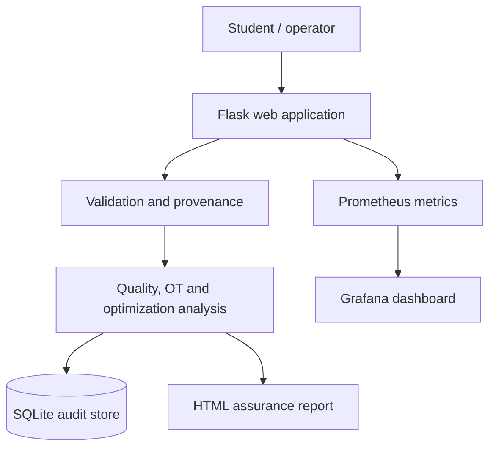
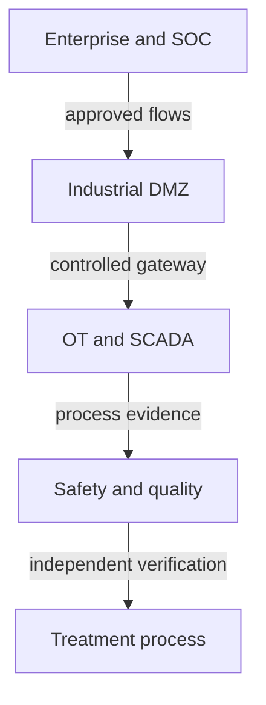
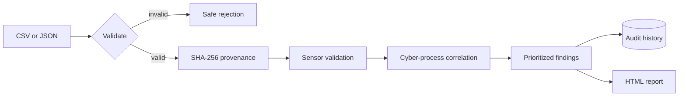

# AquaVigil architecture

## System architecture

## Water infrastructure trust zones

There is deliberately no direct enterprise-to-treatment command path. The demonstration application consumes exported synthetic evidence; it does not connect to these zones.

## Data-flow diagram

## Security architecture

| Boundary | Control | Rationale |
|---|---|---|
| Browser → application | File type/size checks and safe parsing | Reduces malformed input and resource risk |
| Evidence → analysis | In-memory read-only parsing and SHA-256 hash | Preserves provenance without altering the source |
| Application → database | Parameterized SQLite queries | Prevents SQL injection in stored fields |
| Application → monitoring | Metrics-only endpoint | Observability without operational control |
| Report → reviewer | Explicit limitations and evidence references | Prevents overstated conclusions |

## Deployment model

The Docker Compose stack is intentionally small enough for one student to explain: one application, one Prometheus service and one Grafana service. For enterprise scale, replace SQLite with managed PostgreSQL, use object storage for evidence, add authentication/RBAC, queue long-running analysis, sign reports, encrypt secrets and deploy redundant stateless application replicas behind a reverse proxy.
