# AquaVigil Architecture

> **Scope:** AquaVigil is a defensive, read-only educational prototype. The diagrams below describe the software demonstration and conceptual trust boundaries. They do not authorize connection to, or control of, real water utilities, SCADA systems, PLCs, pumps, valves, dosing systems, or safety functions.

## 1. Platform context

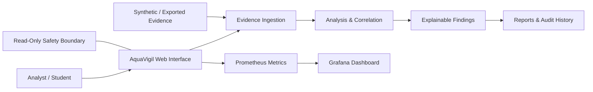

AquaVigil accepts exported evidence, validates it, analyzes water/process and cybersecurity observations, correlates findings, and presents traceable results. It does not send operational commands.

## 2. End-to-end evidence architecture

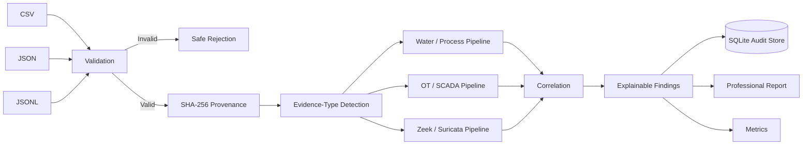

## 3. Logical component architecture

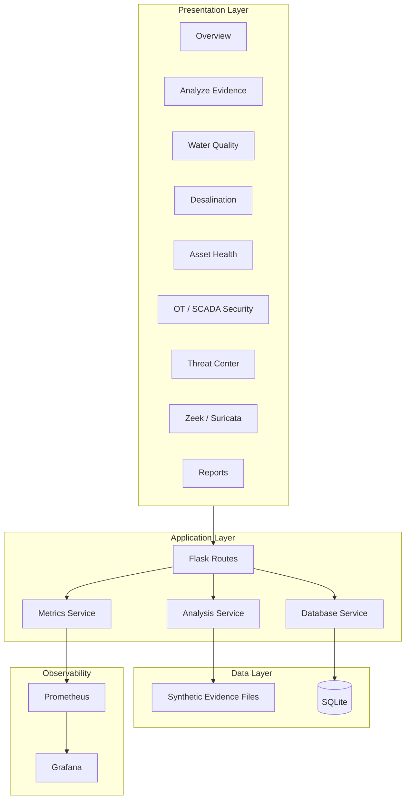

## 4. Water-quality analysis pipeline

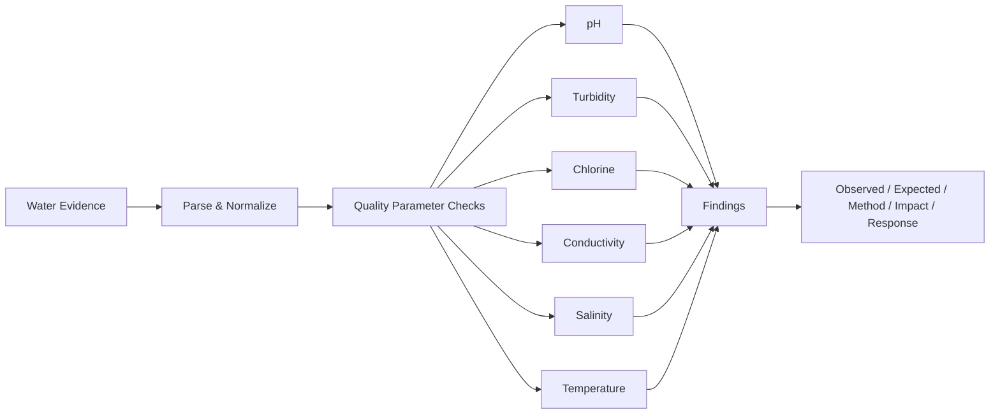

## 5. Desalination intelligence architecture

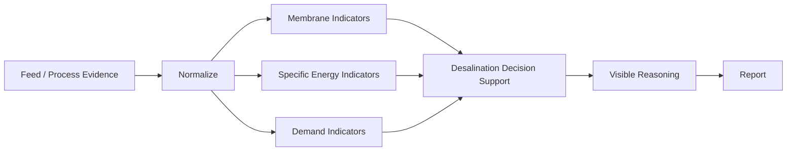

## 6. Asset-health reasoning

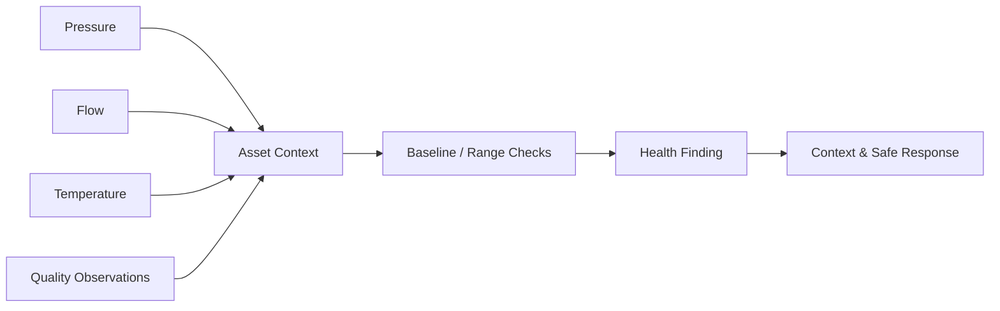

## 7. OT / SCADA defensive architecture

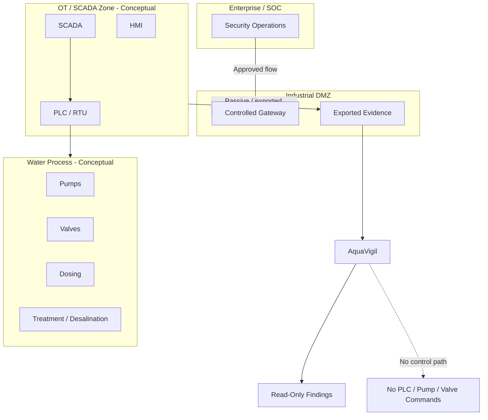

## 8. Trust-zone and industrial-DMZ model

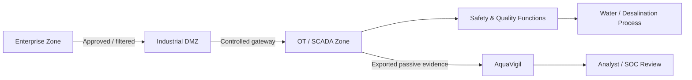

There is deliberately no direct AquaVigil-to-process command path.

## 9. Passive monitoring architecture

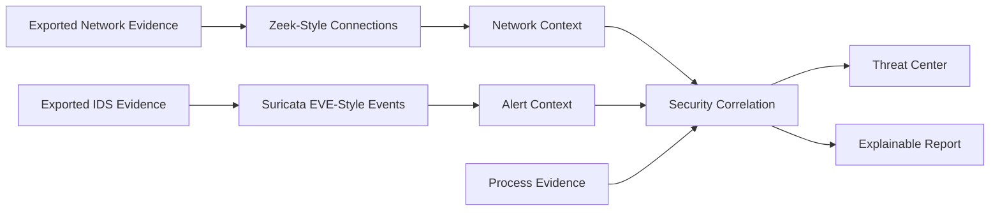

## 10. Cyber-process correlation

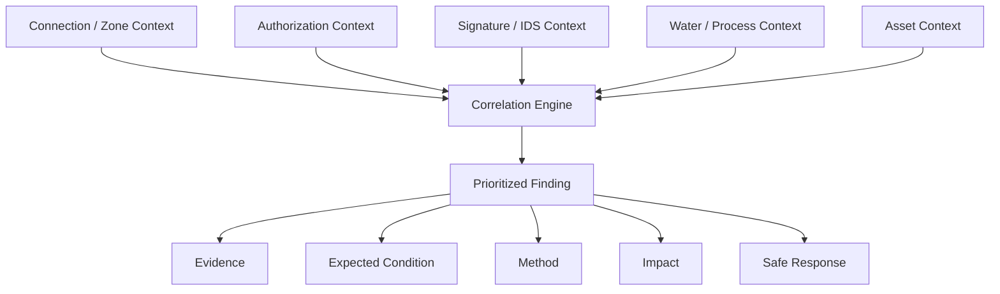

## 11. Anomaly-analysis architecture

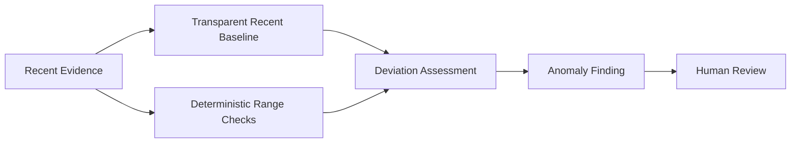

AquaVigil's anomaly layer is decision support, not autonomous process control.

## 12. Reporting and audit architecture

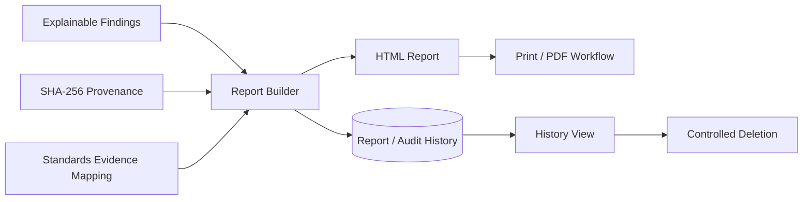

## 13. Observability architecture

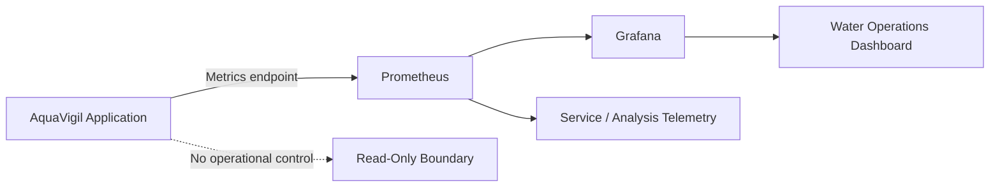

## 14. Docker deployment architecture

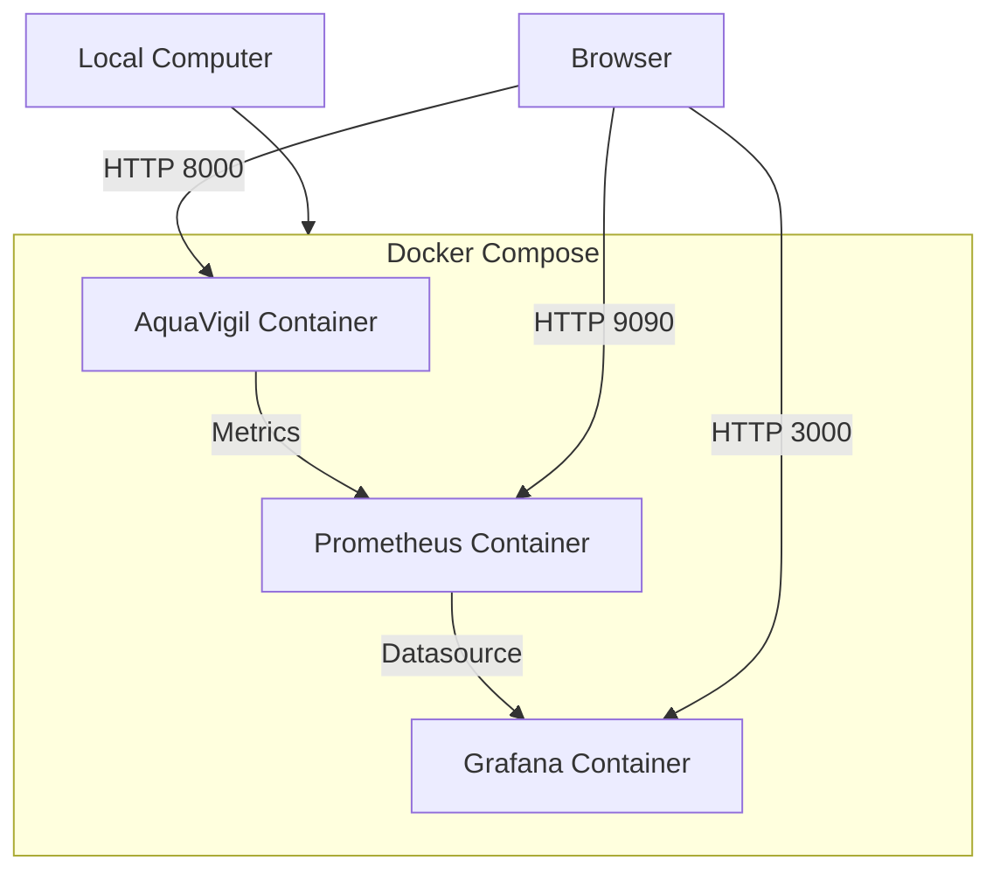

## 15. Application data stores

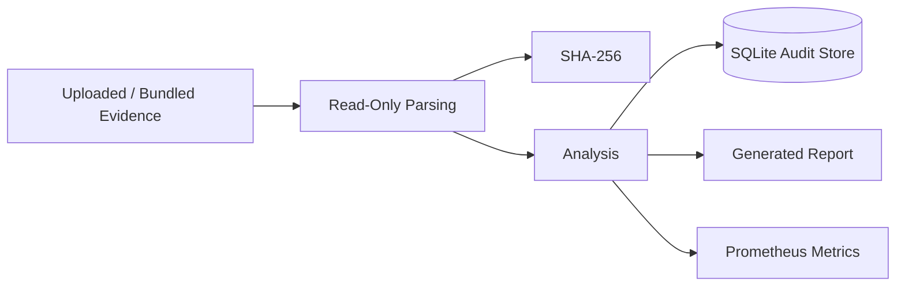

## 16. Safety-boundary architecture

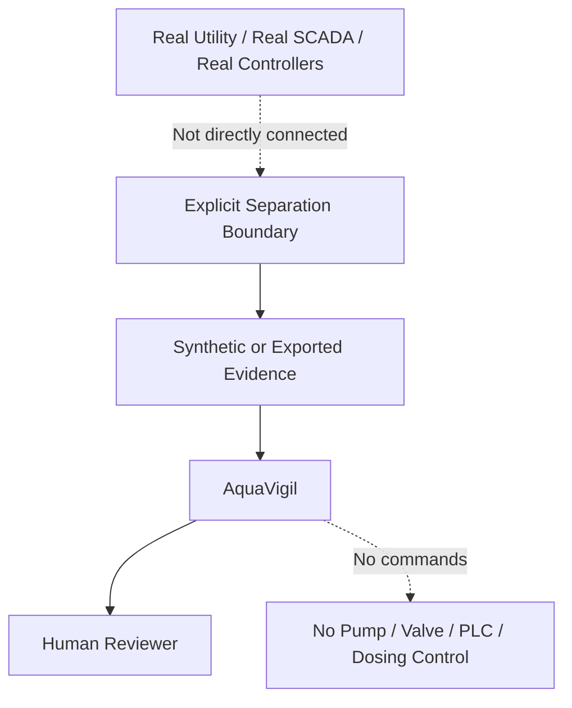

## 17. Failure and recovery architecture

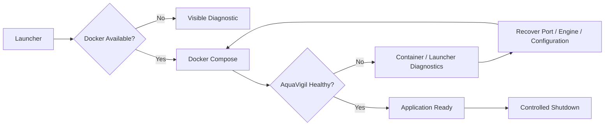

## 18. CI and quality-gate architecture

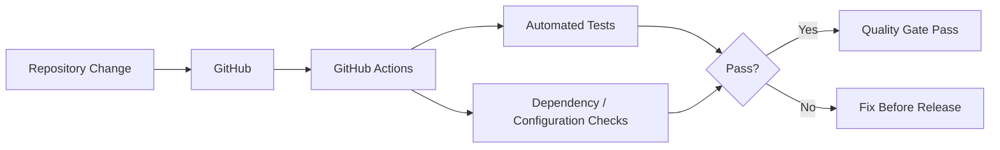

## 19. Conceptual water-process context

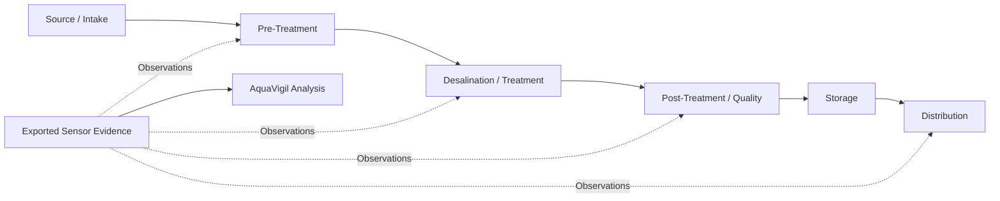

This diagram is conceptual and does not represent a real facility topology.

## 20. Human decision architecture

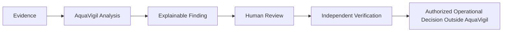

AquaVigil ends at evidence-backed decision support. Operational authority remains outside the application.

## Architecture principles

1. **Read-only by design.** AquaVigil analyzes and visualizes; it does not operate infrastructure.
2. **Evidence before claims.** Findings originate from supplied evidence and retain provenance.
3. **Explainability.** Findings expose the observed condition, expected condition, method, impact, source, and safe response.
4. **Separation of concerns.** Presentation, analysis, persistence, and observability remain distinct.
5. **Passive security context.** Zeek/Suricata-style evidence is consumed as exported evidence rather than captured through an active control path.
6. **Human authority.** Findings support review; they do not replace qualified operators, laboratory verification, or engineering approval.
7. **Reproducible deployment.** Docker Compose defines the application, Prometheus, and Grafana stack.
8. **Safe demonstration.** Bundled datasets are synthetic and suitable for educational testing.

## Current implementation mapping

| Architecture area | Repository implementation |
|---|---|
| Web application | `app/` |
| Routes and workspace views | `app/routes.py`, `app/templates/` |
| Analysis engine | `app/services/analyzer.py` |
| Persistence | `app/db.py` |
| Metrics | `app/metrics.py` |
| Synthetic evidence | `data/` |
| Prometheus | `docker/prometheus.yml` |
| Grafana | `docker/grafana/` |
| Container stack | `docker-compose.yml` |
| Tests | `tests/` |
| Launchers | `OPEN-AQUAVIGIL.vbs`, `START-AQUAVIGIL.cmd`, `start-aquavigil.ps1`, `start-aquavigil.sh` |

## Deployment note

The current v1.0.0 Docker Compose model intentionally stays small: AquaVigil, Prometheus, and Grafana. A production utility architecture would require a separately engineered and authorized design including identity, RBAC, encrypted secret management, hardened gateways, controlled evidence transfer, redundant services, managed persistence, signed reports, formal change control, and independent safety/security review. Those capabilities are outside the v1.0.0 educational prototype.
